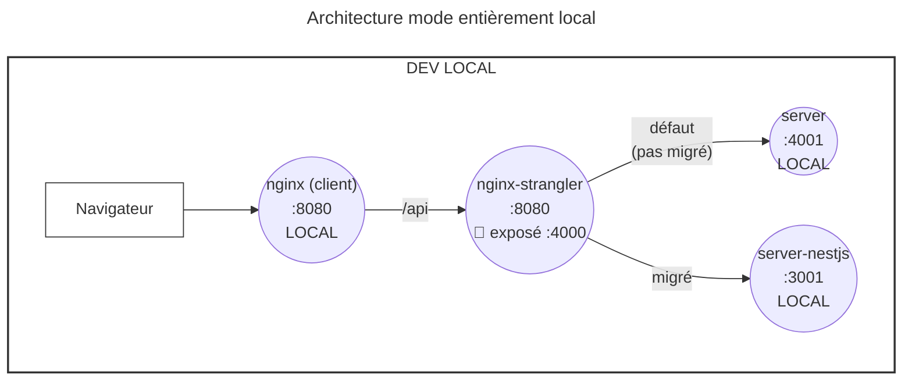
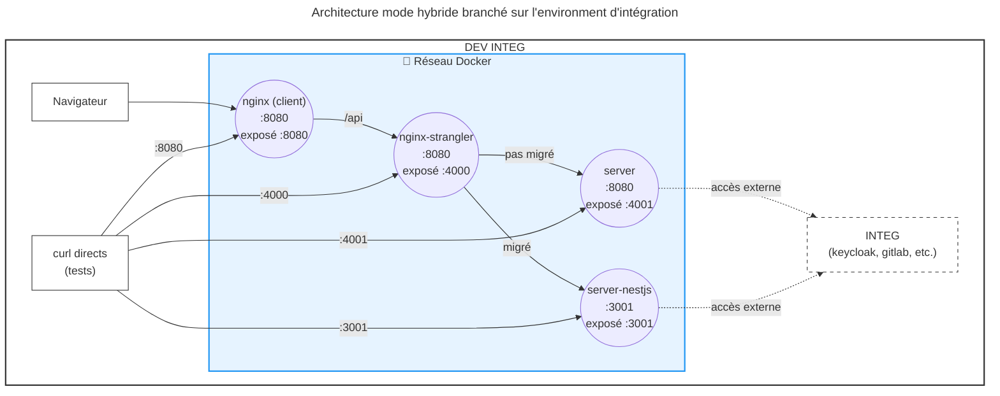

# Fichiers de configuration d'environnements

Cette documentation a pour but de détailler tout ce qui concerne la gestion des configuration d'environnements (appelé couramment "fichiers .env").

Comme vous aurez pu le constater, il y a beaucoup de choses à configurer pour un projet d'ampleur comme l'est la Console de CPiN, et il y a des cas d'usages très spécifiques qui seront décrits ici. Vous avez également la possibilité de composer votre propre manière de gérer vous variables d'environments en vous basant sur ce qui a été fait pour nous.

## Contexte : migration progressive vers NestJS (Strangler Fig)

Le backend de la console est en cours de migration de `apps/server` (Fastify/legacy) vers `apps/server-nestjs` (NestJS). Cette migration est progressive, route par route, selon le [Strangler Fig Pattern](https://martinfowler.com/bliki/StranglerFigApplication.html).

Pour orchestrer cette migration, un **nginx-strangler** a été introduit (ticket [#1885](https://github.com/cloud-pi-native/console/issues/1885)). Il s'intercale entre le `client` et les backends, et route chaque requête API vers le bon service :

```
[client :8080]
      │ proxy /api → nginx-strangler:8080
      ▼
[nginx-strangler :8080]
      ├── /api/[routes migrées]  ──→  server-nestjs:3001  (NestJS)
      └── /api/[tout le reste]   ──→  server:8080         (legacy)
```

**Conséquences pratiques pour les développeurs :**

- `server-nestjs` est désormais présent dans tous les `docker-compose` aux côtés de `server`.
- Le `nginx-strangler` est le nouveau point d'entrée unique pour les appels API — le `client` ne pointe plus directement vers `server`.
- Consultez [`MODULARISATION-STATUT.md`](apps/server-nestjs/documentation/Modularisation-de-console-server/MODULARISATION-STATUT.md) avant de développer sur un module backend, pour savoir s'il est en cours de migration (zones en feature freeze).
- Si vous travaillez sur un module déjà migré vers `server-nestjs`, développez dans `apps/server-nestjs`, pas dans `apps/server`.

Pour plus de détails sur la stratégie de migration : [`apps/nginx-strangler/README.md`](apps/nginx-strangler/README.md).

---

## Cas d'usage supportés

Avant de décrire dans le détail comment configurer les différents environments, il est important de rappeler les Cas d'Usage qui sont supportés par les scripts de CPiN:

- **Développement totalement en local** : vous déployez l'entièreté de l'écosystème de `console`, sans considération d'un branchement à l'extérieur, et vous développez directement en mode "serve" sur `client`, `server`, `server-nestjs`, un `plugin` en particulier, ou peut-être même une combinaison des trois.
- **Développement conteneurisé en local** : vous déployez l'entièreté de l'écosystème de `console`, sans considération d'un branchement à l'extérieur, et même les composants fondamentaux de console (comme `client`, `server` et `server-nestjs`) dans des conteneurs à l'aide d'images construites précédemment (en local, ou alors tirée depuis le registre de l'organisation CPiN)
- **Développement conteneurisé hybride** : vous déployez localement seulement une partie de l'écosystème de `console` (`client` et/ou `server`/`server-nestjs`, de manière à utiliser votre code local) et pour le reste (Base de données de `console`, `keycloak`, `gitlab`, les clusters applicatifs, etc.), vous vous branchez à un environnement existant (appelé `integ` pour `INTEGRATION`). Ce cas d'usage est très pratique pour tester votre code avec de "vraies données" d'un environnement fonctionnel (comme notre environnement interne `cpin-hp`)
- Les cas de déploiements finaux du système complet, qui sont eux adressé par un chart Helm stocké dans [le dépôt `helm-charts`](https://github.com/cloud-pi-native/helm-charts)

Maintenant que ces définitions sont établies, passons à la configuration pour chacun des cas d'usage

## Considérations communes à tous les cas

Le mode de fonctionnement de la configuration des environnements est assez classique : les applications `client`, `server` et `server-nestjs` ont besoin d'avoir certaines variables d'environnements définies.

Le mécanisme de surcharge des différentes configurations fonctionne de cette manière :

```
->: «surcharge»

var d'env settée explicitement -> fichier .env.docker (si contexte docker) -> fichier .env.integ (si INTEGRATION=true) -> fichier .env
```

## Prégénération des fichiers .env, .env.docker, et .env.integ

Un script permet de copier facilement les fichiers `.env*-example` en leur équivalent `.env*`: [`./ci/scripts/init-env.sh`](./ci/scripts/init-env.sh).

> Il faut ensuite remplir ces fichiers, car ils ne sont là que simplement copiés avec les valeurs par défaut

## Configuration pour le développement entièrement en local

Le développement entièrement en local suit cette organisation des composants:



Docker Compose utilisé : [`docker/docker-compose.local.yml`](docker/docker-compose.local.yml) (infrastructure uniquement : Keycloak, PostgreSQL, pgAdmin, OpenCDS mock, **nginx-strangler, et Jaeger**)

Fichiers utilisés :

- `apps/client/.env`
- `apps/server/.env`
- `apps/server-nestjs/.env` *(si vous travaillez sur server-nestjs)*

Les valeurs par défaut, disponibles dans les fichiers `.env-example`, sont suffisantes dans 99% des cas. Cela dit, c'est un cas d'usage assez restreint car la console se reposant sur quelques composants externes comme une base de données PostgreSQL ou un serveur IAM comme `keycloak`, il faut configurer manuellement les `.env` pour pointer sur les bonnes URLs, etc. Pas infaisable, mais pas très pratique au quotidien, hors des cas simple de build des applications.

**Commandes de lancement :**

```bash
# Lance l'infrastructure (Keycloak, PostgreSQL, pgAdmin, OpenCDS mock, nginx-strangler, Jaeger)
pnpm dev

# Puis dans d'autres terminaux, lancer les serveurs et le client manuellement :
pnpm --filter server run dev
pnpm --filter server-nestjs run start:dev  # nouveau backend NestJS
pnpm --filter client run dev
```

### Faire transiter les appels API par le nginx-strangler en dev local

Par défaut, le proxy Vite du `client` pointe directement vers `server` (port `4000`). Pour faire transiter les appels via le `nginx-strangler` (utile pour tester le routage de migration ou travailler sur `server-nestjs`), une seule variable suffit dans `apps/client/.env` :

```bash
# apps/client/.env
SERVER_PORT=8082   # port du nginx-strangler exposé par docker-compose.local.yml
                   # (au lieu de 4000 qui pointe directement vers server)
```

Le `nginx-strangler` est automatiquement lancé par `pnpm dev` via `docker-compose.local.yml`. Il écoute sur `localhost:8082` et redirige vers les deux backends natifs (`server:4000` et `server-nestjs:3001`) selon la configuration de [`apps/nginx-strangler/conf.d/routing.conf`](apps/nginx-strangler/conf.d/routing.conf).

> **Note :** si vous ne travaillez pas sur la migration NestJS, vous n'avez pas besoin de changer `SERVER_PORT` — le comportement par défaut (proxy direct vers `server:4000`) reste identique.

### Observabilité : Jaeger + OpenTelemetry (traces)

Le fichier [`docker/docker-compose.local.yml`](docker/docker-compose.local.yml) démarre un service `jaeger` (image `jaegertracing/all-in-one`) pour collecter et visualiser les traces.

- UI Jaeger : http://localhost:16686
- Endpoints de collecte exposés sur la machine hôte :
  - OTLP gRPC : `localhost:4317`
  - OTLP HTTP (protobuf) : `http://localhost:4318`

Dans `apps/server-nestjs`, l'instrumentation OpenTelemetry est initialisée au démarrage via [`src/instrumentation.ts`](apps/server-nestjs/src/instrumentation.ts) (appelée depuis `main.ts`) et exporte via OTLP.

Pour vérifier rapidement :

1. Démarrer l'infra : `pnpm dev` (Jaeger inclus).
2. Démarrer `server-nestjs` : `pnpm --filter server-nestjs run start:dev`.
3. Exécuter une requête sur une route backend (depuis le client ou un `curl`).
4. Ouvrir http://localhost:16686 et chercher le service `cloud-pi-native-console`.

## Configuration pour le développement conteneurisé en local

Docker Compose utilisé : [`docker/docker-compose.dev.yml`](docker/docker-compose.dev.yml) (tout conteneurisé avec Docker Compose Watch)

Fichiers utilisés :

- `apps/client/.env`
- `apps/client/.env.docker`
- `apps/server/.env`
- `apps/server/.env.docker`
- `apps/server-nestjs/.env`
- `apps/server-nestjs/.env.docker`

Cette configuration est déjà plus intéressante, car elle s'appuie sur les conteneurs définis dans [ce docker-compose](docker/docker-compose.dev.yml), qui lance notamment une base de données PostreSQL (ainsi qu'un `pgadmin`), et un serveur Keycloak préchargé avec un royaume qui contient un jeu de données. Le docker-compose contient des instructions `develop` qui permettent soit de synchroniser certains fichiers, soit de carrément reconstruire l'image et de relancer le service concerné. De cette manière vous pouvez développer en laissant les conteneurs tourner. C'est un peu moins performant qu'un travail totalement en local, mais ça a le mérite d'être plus proche du déploiement cible.

Le `nginx-strangler` et `server-nestjs` sont inclus dans ce docker-compose et démarrent automatiquement. Le `client` pointe vers `nginx-strangler` — le routage API est donc toujours actif, même si aucune route n'est encore basculée vers NestJS (tout passe par `server` en fallback).

**Commande de lancement :**

```bash
# Lance l'ensemble des conteneurs (client, server, server-nestjs, nginx-strangler,
# keycloak, postgres, pgadmin, opencds mock) avec Docker Compose Watch
pnpm docker:dev
```

## Configuration pour le développement hybride avec un environnement d'intégration existant

Le développement hybride branché sur l'environnement d'intégration suit cette organisation des composants:



Docker Compose utilisé : [`docker/docker-compose.integ.yml`](docker/docker-compose.integ.yml) (sans Keycloak, branché sur l'environnement d'intégration distant)

Fichiers utilisés :

- `apps/client/.env`
- `apps/client/.env.docker`
- `apps/client/.env.integ`
- `apps/server/.env`
- `apps/server/.env.docker`
- `apps/server/.env.integ`
- `apps/server-nestjs/.env`
- `apps/server-nestjs/.env.docker`
- `apps/server-nestjs/.env.integ` *(si vous travaillez sur server-nestjs en mode integ)*

Cette configuration est une itération de la précédente. Dans ce cas d'usage le Keycloak n'est pas créé en tant que conteneur, car on est supposé se brancher sur l'environnement d'intégration défini dans les fichiers `.env.integ`. Le contenu de ces fichiers (en particulier celui de `apps/server`) est donc clé.

Le `nginx-strangler` et `server-nestjs` sont également inclus dans ce docker-compose.

**Commandes de lancement :**

```bash
# Option 1 : Tout conteneurisé, branché sur l'environnement d'intégration
pnpm docker:integ

# Option 2 : Seulement l'infra en Docker (postgres, pgadmin), server et client en local avec mode integ
pnpm integ
# Puis dans d'autres terminaux :
pnpm --filter server run dev
pnpm --filter server-nestjs run start:dev
pnpm --filter client run dev
```
