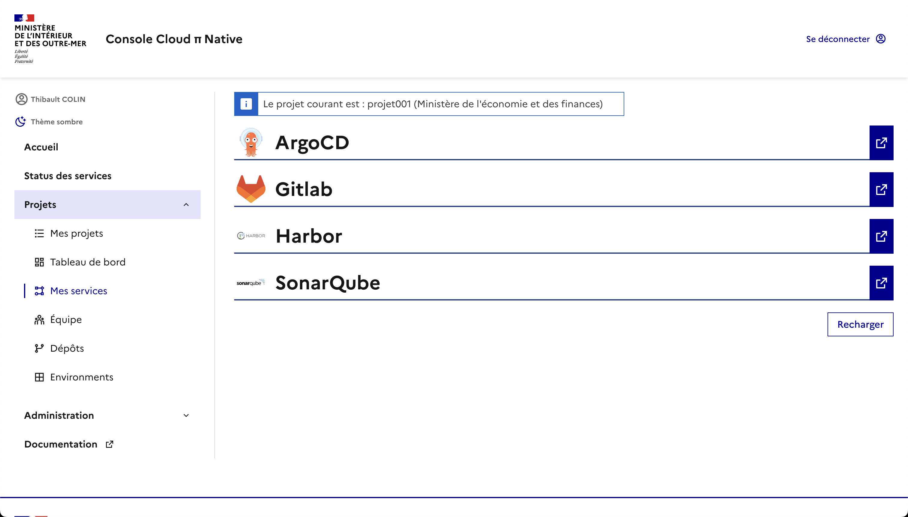

# Console Cloud π Native

La console Cloud π Native est une application web ayant pour but de piloter des services dans un cluster Kubernetes afin de fournir une plateforme cloud qui accompagne les produits numériques lors de toutes les phases de leur cycle de vie.

Cette console offre une interface unifiée vers un ensemble de services tout en garantissant une cohérence globale du système avec la création automatique d'un certain nombre de ressources comme les comptes d'accès, les robots ou encore des ressources Kubernetes.
En addition du provisionnement automatique, elle garantit aussi le contrôle d'accès aux ressources du projet à l'aide d'une gestion d'équipe, de permissions, de quotas, etc.

</img> </img> </img> </img> </img> </img>

## Démarrage Rapide (OnBoarding)

Afin de démarrer rapidement l'application pour la découvrir il vous faudra d'abord cloner ce dépôt, puis satisfaire à un certain nombre de prérequis.

### Cloner le projet

```bash
git clone https://github.com/cloud-pi-native/console.git

# Se rendre dans le dossier du projet
cd console
```

### Prérequis

#### Prérequis techniques du projet

- [Docker >= v27](https://docs.docker.com/get-docker/) Orchestrateur de conteneurs
  - [Plugin compose >= v2.35](https://github.com/docker/compose) (attention à ne pas avoir une vieille version qui traînerait dans `~/.docker/cli-plugins/` !). Permet de composer plusieurs conteneurs Docker
  - [Plugin buildx](https://github.com/docker/buildx) Permet d'étendre les capacités de Docker à l'aide de BuildKit
- [Node.js >= v24](https://nodejs.org/en/download/) Environnement d'exécution JavaScript
- [PnPM >= v10](https://pnpm.io/installation) Gestionnaire de paquets pour JavaScript

#### Prérequis de configuration du projet

Afin de pouvoir démarrer l'application, il vous faudra également récupérer (ou bien créer vous-même) les fichiers :

- `apps/client/.env.docker`
- `apps/client/.env.integ`
- `apps/server/.env.docker`
- `apps/server/.env.integ`

Si vous ne les avez pas déjà, référez-vous à [./ENVIRONMENTS.md](./ENVIRONMENTS.md) qui est la documentation consacrée au sujet.

### Lancement rapide utilisant l'application en local et les services sur un environnement distant

Maintenant que vous avez les prérequis projets (prérequis techniques et de configuration), vous pouvez construire et lancer l'application localement, en la couplant avec les services (par exemple Keycloak) d'un environnement d'intégration :

```bash
# Installer toutes les dépendances
$ pnpm install

# Initialiser la base de données PostgreSQL lancée localement
$ pnpm db:generate

# Construire les applications client et server
$ pnpm build

# Construire les images dockers client et server, puis lancer la stack docker compose d'intégration
$ export KUBECONFIG_HOST_PATH="$HOME/.kube/config" && pnpm run docker:integ
```

Cette série de commandes va installer les diverses dépendances, construire l'intégralité de l'application Console (client et serveur) dans des images docker locales, et finalement lancer l'application en la connectant dans votre infrastructure d'Intégration existante.

Si vous voulez une vue plus approfondie du lancement de l'application, vous pouvez vous référer à la [section détaillée à ce sujet](#développement).

## Architecture

Ce projet est construit avec [NodeJS](https://nodejs.org/), [VueJS](https://vuejs.org/), [Postgres](https://www.postgresql.org/) et [Keycloak](https://www.keycloak.org/).
Le serveur et le client sont livrés sous forme d'images [Docker](https://www.docker.com/) et sont déployées à l'aide de [Helm](https://helm.sh/) dans [Kubernetes](https://kubernetes.io/).

### API

Le serveur est construit selon une architecture __core / plugins__ pour favoriser l'évolutivité et l'ajout de nouvelles fonctionnalités / la gestion de nouveaux services. Pour ce faire, les plugins s'enregistrent auprès de différents `hooks` (qui suivent le cycle de vie d'un projet au sein de l'application), ces derniers seront déclenchés par les contrôleurs de l'application.

Plusieurs plugins sont nativement enregistrés auprès du serveur pour assurer le bon fonctionnement de la plateforme, à savoir :

- [Argocd](https://argo-cd.readthedocs.io/en/stable/)
- [Gitlab](https://about.gitlab.com/)
- [Harbor](https://goharbor.io/)
- [Keycloak](https://www.keycloak.org/)
- [Kubernetes](https://kubernetes.io/)
- [Nexus](https://www.sonatype.com/products/sonatype-nexus-repository)
- [Sonarqube](https://www.sonarsource.com/products/sonarqube/)
- [Vault](https://www.vaultproject.io/)

> Pour plus d'informations sur le développement d'un plugin, voir :
>   - [documentation des plugins](./misc/plugins.md).
>   - [documentation du module hooks](./packages/hooks/README.md).
>   - [exemple de plugin](https://github.com/cloud-pi-native/console-plugin-helloworld).

## Développement

Le développement s'effectue à l'aide de Docker *(le client et le serveur peuvent tourner en local ou dans Docker)*.

### Construire l'application

Une fois le projet cloné, lancez les commandes suivantes dans votre terminal pour installer le projet et construire l'ensemble de l'application `console` :

```shell
# Installer les dépendances du projet
pnpm install

# Créer les fichiers d'environnement exemples
./ci/scripts/init-env.sh

# Générer le client Prisma côté serveur
pnpm --filter @cpn-console/server run db:generate

# Construire tous les paquets applicatifs
pnpm build
```

#### Lancer l'application

L'application peut se lancer de plusieurs manières, à savoir :

__Déploiement local du client et du serveur de la console, le reste dans des conteneurs :__

```shell
# Lancer keycloak, postgres et pgadmin dans des conteneurs
pnpm run dev

# Lancer le serveur dans un shell (la commande va afficher les logs)
pnpm --filter @cpn-console/server run dev

# Lancer le client dans un shell (la commande va afficher les logs)
pnpm --filter @cpn-console/client run dev

# …une fois que vous terminé d'utiliser l'application:

# Supprimer les conteneurs keycloak, postgres et pgadmin
pnpm run dev:clean

# Supprimer les conteneurs keycloak, postgres et pgadmin (supprime les volumes docker)
pnpm run dev:delete
```

__Tout dans des conteneurs :__

```shell
# Lancer l'application
pnpm run docker:dev

# Supprimer les conteneurs
pnpm run docker:dev:clean

# Supprimer les conteneurs (supprime également les volumes !)
pnpm run docker:dev:delete
```

> Pour lancer le debugger Node.js sur le serveur, dans les fichiers `docker-compose` remplacer la directive  `command: ["dev"]` par `command: ["debug"]`.

#### Intégration

L'application peut se lancer de plusieurs manières, à savoir :

__Déploiement local du client et du serveur de la console, le reste dans des conteneurs :__

```shell
# Lancer postgres et pgadmin dans des conteneurs
# (le keycloak utilisé devra être configuré dans les .env.integ)
pnpm run integ

# Lancer le serveur
pnpm --filter @cpn-console/server run integ

# Lancer le client
pnpm --filter @cpn-console/client run integ

# Supprimer les conteneurs postgres et pgadmin
pnpm run integ:clean

# Supprimer les conteneurs postgres et pgadmin (supprime les volumes docker)
pnpm run integ:delete
```

__Tout dans des conteneurs :__

```shell
# Lancer l'application
pnpm run docker:integ

# Supprimer les conteneurs
pnpm run docker:integ:clean

# Supprimer les conteneurs (supprime les volumes docker)
pnpm run docker:integ:delete
```

#### Utilitaires

Les commandes utilitaires de l'application :

```shell
# Formattage du code
pnpm run format

# Lancer la vérification syntaxique
pnpm run lint

# Lancer les tests unitaires
pnpm run test

# Lancer les tests de composants
pnpm run test:ct
```

L'intégralité des commandes est disponibles dans le fichier [package.json](./package.json) à la racine du projet, vous pouvez lancer ces dernières à l'aide de la commande `pnpm run <le_nom_du_script>`.

### Tests Playwright

Se référer à la [documentation concernée](./playwright/README.md).

### Accès aux services

Les services sont disponibles via les ports suivants :

| Service                                        | Url (local/docker)      |
| ---------------------------------------------- | ----------------------- |
| Interface graphique *- (client)*               | <http://localhost:8080> |
| Serveur *- (api)*                              | <http://localhost:4000> |
| Interface d'administration de base de données  | <http://localhost:8081> |
| Interface d'administration du serveur keycloak | <http://localhost:8090> |

*__Notes:__ ⚠ Il est possible que le navigateur utilisé (particulièrement Brave ou Firefox) bloque les cookies utilisés entre le frontend et keycloak, il est nécessaire de désactiver les protections de ce type dans votre navigateur (ex: Brave Shield).*

### Informations de connexion

Les comptes utilisés pendant le développement sont les suivants :

| Service            | Nom d'utilisateur | Mot de passe |
| ------------------ | ----------------- | ------------ |
| Keycloak *(admin)* | `admin`           | `admin`      |
| Keycloak *(user)*  | `test`            | `test`       |
| PgAdmin            | `admin@dso.fr`    | `admin`      |
| Postgres           | `admin@dso.fr`    | `admin`      |

> La liste complète des comptes Keycloak pré-créés est disponible [ici](./keycloak/realms/realm-dev.json).

> Le nom de la base de données est : `dso-console-db`.

### Variables d'environnements

__Local / Docker:__

Les variables d'environnements sont gérées localement via des fichiers `.env` (local) / `.env.docker` (docker) dans les dossiers `./apps/server` et `./apps/client`, aux précédents fichiers s'ajoute un fichier `.env.integ` utilisé pour le mode intégration (local et docker).

### Base de données

Pour faciliter les opérations de migrations de base de données via [Prisma](https://www.prisma.io/), un script est disponible :

```shell
# Lancer le script
pnpm --filter @cpn-console/server run db:wrapper

# Voir l'aide du script
pnpm --filter @cpn-console/server run db:wrapper -h
```

### Débogage avec VS Code

Le projet est configuré pour être débogué directement dans VS Code via le fichier `.vscode/launch.json`.
Rendez-vous dans l'onglet "Run and Debug" (ou `Ctrl+Shift+D`) pour voir les configurations disponibles.

#### Configurations disponibles

- **Launch Server** : Lance le serveur en local (hors Docker) et attache le débogueur.
  - *Note : Assurez-vous que les bases de données (Postgres) et Keycloak sont accessibles (ex: lancés via `pnpm run dev` dans un autre terminal pour les dépendances).*
- **Attach Server** : S'attache au processus Node.js du serveur.
  - Utile lorsque le serveur tourne dans un conteneur Docker.
  - Pour que cela fonctionne, le serveur doit être lancé avec le mode debug activé.
- **Serve Client (Chrome/Firefox)** : Lance l'application client en local et ouvre une instance de navigateur dédiée au débogage.
- **Launch (Chrome/Firefox)** : Lance simultanément le serveur et le client pour une session de débogage complète (Compound task).

#### Déboguer avec d'autres outils (Chrome DevTools, WebStorm, etc.)

Le serveur Node.js expose le port de débogage `9229` lorsqu'il est lancé en mode debug (ou avec l'option `--inspect`). Vous pouvez utiliser n'importe quel client de débogage compatible avec le protocole Inspector de Node.js.

**Exemple avec Chrome DevTools :**

1. Lancez le serveur en mode debug (voir section précédente pour Docker, ou `pnpm run debug` en local).
2. Ouvrez Chrome et naviguez vers `chrome://inspect`.
3. Cliquez sur "Open dedicated DevTools for Node" ou attendez que votre target apparaisse sous "Remote Target".
4. Vous pouvez maintenant mettre des points d'arrêt, inspecter les variables, etc.

### Construction des images

Ce dépôt utilise des fichiers docker-compose pour construire les images docker:

- [docker-compose.dev.yml](./docker/docker-compose.dev.yml) pour la construction des images docker du mode développement.
- [docker-compose.ci.yml](./docker/docker-compose.ci.yml) pour la construction des images docker utilisées dans nos pipelines d'Intégration Continue.
- [docker-compose.prod.yml](./docker/docker-compose.prod.yml) pour la construction des images docker du mode production.

## Configuration du Keycloak

Pour pouvoir gérer les droits utilisateurs des services le pod `server` doit accéder aux groupes des users. Cela signifie modifier le clientScope `profile`:

- Onglet `Mappers`
- `Add Mappers > By configuration > Group Membership`
  - Name: `groups`
  - Token Claim Name: `groups`
  - Full group path: `off`
  - Add to ID token: `on`
  - Add to access token: `on`
  - Add to userinfo: `off`

> En environnement de dev l'import par défaut prévoit déjà cette modification.

Les utilisateurs faisant parti du group `admin` ont également accès à l'interface administrateur de la console une fois connectés via un onglet supplémentaire `Administration` dans le menu latéral de l'application.

## Tableau des ressources, terminologie

| Console Cloud Pi | Projet                       | Environnement | Dépots                                  | Utilisateur / membre |
| ---------------- | ---------------------------- | ------------- | --------------------------------------- | -------------------- |
| __Openshift__    |                              | Namespace     |                                         |                      |
| __ArgoCD__       |                              |               | (infra) Secret, AppProject, Application |                      |
| __Gitlab__       | Group                        |               | Repository (Dépôt)                      | User                 |
| __Harbor__       | Project                      |               | Repository [1]                          |                      |
| __Keycloak__     |                              | Group         |                                         | User / member        |
| __Sonar__        | User                         |               |                                         |                      |
| __Nexus__        | Repositories, role, user ... |               |                                         |                      |

[1] N'est pas crée par la console mais par le produit de la CI

## Architecture du dépôt

La gestion des dépendances est effectuée à l'aide de [pnpm](https://pnpm.io/) selon la structure de dossiers suivante :

- Les différentes briques applicatives se trouvent dans le dossier `apps/`.
- Les bibliothèques additionnelles se trouvent dans le dossier `packages/`.
- Les plugins core se trouvent dans le dossier `plugins/`.

*Schema de l'architecture du monorepo :*

```shell
./
├── apps
│   ├── client
│   └── server
├── packages
│   ├── eslintconfig
│   ├── hooks
│   ├── shared
│   ├── test-utils
│   └── tsconfig
├── plugins
│   ├── argocd
│   ├── gitlab
│   ├── harbor
│   ├── keycloak
│   ├── kubernetes
│   ├── nexus
│   ├── sonarqube
│   └── vault
├── package.json
├── pnpm-lock.yaml
├── pnpm-workspace.yaml
├── turbo.json
└── README.md
```

# Organisation avec Git

Une requête de fusion ("merge request") doit être faite avec la branche `main` comme destination.

La branche de base **doit** être à jour avec `origin/main` (utiliser `git pull origin/main && git rebase origin/main` ou l'option de rebasage dans l'interface Web si besoin) avant la demande de fusion (MR).

## Conventions de nommage

Cf. [Conventions - MIOM Fabrique Numérique](https://docs.fabrique-numerique.fr/conventions/nommage.html).

Les commits doivent suivre la spécification des [Conventional Commits](https://www.conventionalcommits.org/en/v1.0.0/). Cette norme est utilisée pour construire la nouvelle version, voir ci-après.

Il est possible d'ajouter l'[extension VSCode](https://github.com/vivaxy/vscode-conventional-commits) pour faciliter la création des commits.

> Les messages de commits sont rédigés en anglais.

## Gestion des versions

Se référer à [./RELEASE.md](./RELEASE.md).

## Gestion des dépendances

### Mise à jour des dépendances

À propos du cycle de vie des dépendances, et notamment leur mise à jour, un document spécifique est disponible [ici](https://github.com/cloud-pi-native/documentation-interne-socle/blob/main/Divers/Mode-op%C3%A9ratoire-mont%C3%A9es-version-librairies.md). Ce document détaille la stratégie choisie en interne de mise à jour des dépendances de la Console CPiN.

Concernant la mise à jour de `browserlist` et de `caniuse-lite`, utiliser la commande suivante sachant qu'on utilise `pnpm` :

```shell
$ pnpm update caniuse-lite -r
```

### Dépendances Helm

La console embarque une dépendance avec le Helm Chart utilisé par ArgoCD pour consommer le fichier values qu'elle construit. Afin d'assurer la compatibilité, il faut toujours que la version du Helm chart associé ait été publiée au préalable (voir [la documentation dédiée](https://github.com/cloud-pi-native/helm-charts?tab=readme-ov-file#contribution)).
