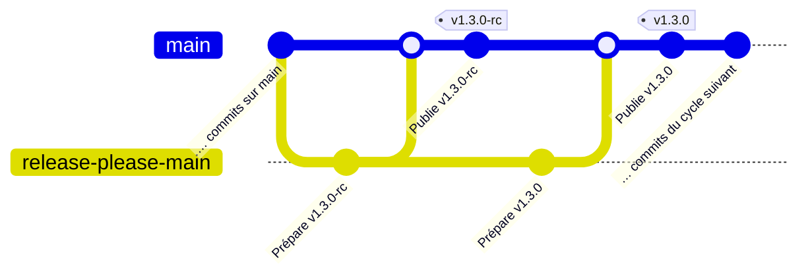

# Gestion des versions

Ce document décrit comment est géré le versionnement de `console`, c'est-à-dire :

- Préparer les pré-releases et les releases stables de `console`
- Créer effectivement les versions correspondantes
- Mettre à jour le chart Helm concerné
- Publier les nouvelles versions de modules NPM concernés

## Incrémentation des versions

Afin d'éviter une confusion entre les hotfixes — historiquement des versions `PATCH` rétroportées sur `main` — et les versions régulières produites par des commits `fix:`, les releases stables adoptent le protocole suivant :

- Les versions régulières sur `main` sont par défaut des `MINOR` (et très rarement des `MAJOR`).
- Une release candidate utilise la version stable visée, suffixée par `-rc`, puis `-rc.N` pour les candidates suivantes.
- Les hotfixes restent des versions `PATCH`, mais leur automatisation est actuellement suspendue ; voir la section [Hotfixes](#hotfixes).

La structure de versionnement stable de `console` est donc **`MAJOR`.`MINOR`.`HOTFIX`**. Les RC ont la forme **`MAJOR`.`MINOR`.`HOTFIX`-rc** ou **`MAJOR`.`MINOR`.`HOTFIX`-rc.`N`**.

## Schéma récapitulatif

Les sections suivantes vont expliciter ce schéma:

## Versionnement de Console

Le flux de travail [`create-or-update-release`](https://github.com/cloud-pi-native/console/blob/main/.github/workflows/workflow-create-or-update-release.yml) est déclenché à chaque nouveau commit sur `main`.

Il utilise le job réutilisable [`Next Prerelease and Release`](https://github.com/cloud-pi-native/console/blob/main/.github/workflows/job-release-please.yml) et [release-please-action](https://github.com/googleapis/release-please-action). Deux configurations isolent les états de version :

- [`.github/prerelease-please-config.json`](./.github/prerelease-please-config.json) et son [manifest](./.github/prerelease-please-manifest.json) gèrent les RC ;
- [`.github/release-please-config.json`](./.github/release-please-config.json) et son [manifest](./.github/release-please-manifest.json) gèrent les releases stables. La release stable met aussi à jour le manifest de pré-release afin d'initialiser le cycle suivant depuis cette version.

À chaque exécution, le job `prepare` publie d'abord toute requête de fusion de release déjà fusionnée, puis crée ou met à jour la prochaine requête de fusion. Le cycle est le suivant :

1. Les commits sur `main` créent ou mettent à jour une MR de pré-release.
2. La fusion de cette MR crée la release GitHub et le tag `vX.Y.Z-rc` ; les RC suivantes de la même version sont taguées `vX.Y.Z-rc.N`.
3. Après la création d'une RC, une MR de release stable `vX.Y.Z` est créée ou mise à jour.
4. La fusion de cette MR crée la release GitHub stable `vX.Y.Z`, puis prépare la prochaine MR de pré-release.

Les différents types de commits (`chore:`, `feat:`, `fix:`, etc.) alimentent les sections du `CHANGELOG.md` selon les deux configurations release-please ci-dessus.

Lorsqu'une RC ou une release stable est créée, les images de conteneur des applications (`client`, `server`, etc.) sont publiées dans la [registry GitHub du dépôt](https://github.com/orgs/cloud-pi-native/packages?repo_name=console) avec le tag complet correspondant. Une release stable met aussi à jour les tags partiels `vX` et `vX.Y` ; les RC ne les déplacent jamais.

> Les tags complets (`vX.Y.Z`, `vX.Y.Z-rc` et `vX.Y.Z-rc.N`) sont immutables. Seuls les tags partiels stables (`vX` et `vX.Y`) sont recréés pour référencer la dernière release stable. Après une release stable, il est recommandé d'exécuter `git pull --tags --force` afin de recréer localement ces tags partiels.

## Versionnement du chart Helm `dso-console`

Le déploiement de `console` se fait préférablement à l'aide de son chart Helm, nommé [`dso-console`](https://github.com/cloud-pi-native/helm-charts/tree/main/charts/dso-console).

Lorsqu'une RC ou une release stable est créée, le flux de travail déclenche automatiquement une requête de fusion dans le dépôt `helm-charts` afin de mettre à jour le chart Helm `dso-console` avec l'`APP_VERSION` complète correspondante. Une fusion manuelle sur ce dépôt reste nécessaire pour publier la nouvelle version du chart. Exemple de requête de fusion : https://github.com/cloud-pi-native/helm-charts/pull/204.

> Une RC et une release stable produisent le même type de requête de fusion côté `helm-charts`. Le chart référence cependant l'`APP_VERSION` complète : une RC conserve donc son suffixe `-rc` ou `-rc.N`.

## Versionnement des modules NPM

La publication des nouvelles versions de modules npm du dépôt est automatique et est inclus dans le flux de travail de création d'une nouvelle version. Il analyse les numéros de version présents dans les différents fichiers `package.json` pour déterminer si une nouvelle version du module doit être créée et publiée.

> Il est possible de créer une version de pré-release d'un module npm en modifiant la clé `publishConfig.tag` dans le `package.json` avec par exemple `beta` pour générer une version beta.

## Hotfixes

Autant que faire se peut il vaut mieux privilégier le "Fix Forward" avec de nouvelles versions, afin d'éviter la charger de générer/rétroporter un hotfix.

Ceci étant dit, il arrivera, hélas, qu'un hotfix soit nécessaire sur une version livrée.

> ⚠ Les branches `hotfix/*` ne déclenchent actuellement plus le flux `create-or-update-release`. La procédure automatisée de hotfix est donc suspendue.
>
> En attendant son rétablissement, un correctif destiné à une version livrée doit être intégré à `main` et livré via le prochain cycle de pré-release puis de release stable. Il suit donc la stratégie de « Fix Forward ».
