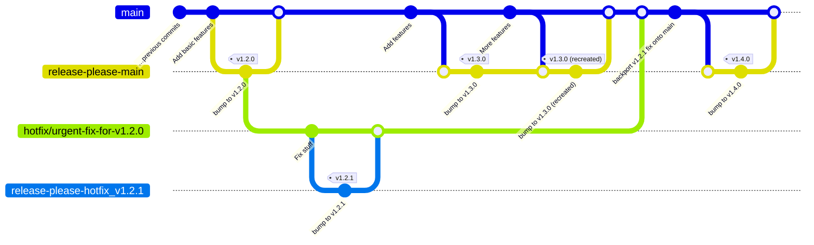

# Gestion des versions

Ce document décrit comment est géré le versionnement de `console`, c'est-à-dire :

- Préparer la création d'une nouvelle version de `console` au fur et à mesure des ajouts
- Créer effectivement la nouvelle version
- Mettre à jour le chart Helm concerné
- Publier les nouvelles versions de modules NPM concernés

## Incrémentation des versions

Afin d'éviter une confusion entre les hotfixes, qui sont des versions `PATCH` qui ensuite rétroportées sur la branche principale (`main`), et les versions régulières qui n'ont que des commits `fix:` (et donc produisent par défaut, elles aussi, des versions `PATCH`), nous avons décidé d'adopter le protocole de versionnement suivant :

- Les versions régulières sur `main` sont par défaut des `MINOR` (et très rarement des `MAJOR`)
- Les versions de hotfix d'une version en particulier sont **forcément** des `PATCH` (ceci est forcé dans le [flux de travail GitHub `Create new release`](https://github.com/cloud-pi-native/console/tree/main/.github/workflows/job-release-please.yml#L39))

La structure de versionnement de `console` est donc **`MAJOR`.`MINOR`.`HOTFIX`**

## Schéma récapitulatif

Les sections suivantes vont expliciter ce schéma:

## Versionnement de Console

Le flux de travail qui créé les nouvelles versions s'intitule [`create-or-update-release`](https://github.com/cloud-pi-native/console/blob/main/.github/workflows/workflow-create-or-update-release.yml) et est déclenché à chaque nouveau commit sur `main` (soit lorsqu'on fusionne une requête de fusion, soit un commit poussé en outrepassant l'interdiction de pousser sur `main`) ou sur une branche `hotfix/*`.

Le flux de travail utilise [release-please-action](https://github.com/googleapis/release-please-action) pour automatiquement générer les tags Git ainsi que les nouvelles versions sur GitHub. À chaque fois que du code est poussé dans la branche `main` ou un branche `hotfix/*`, une requête de fusion de version est créée en analysant les messages de commits pour déterminer le numéro de version à créer (`PATCH`, `MINOR`, ou `MAJOR`). Si une requête de fusion de nouvelle version existe déjà, elle est mise à jour afin de refléter les nouveaux changements ajoutés à la future nouvelle version.

Les différent types de commits (`chore:`, `feat:`, `fix:` etc.) vont alimenter différentes sections de la `CHANGELOG`. Ces sections sont décrites dans la configuration de release-please, [`./release-please-config.json`](./release-please-config.json)

Lorsqu'une requête de fusion de version (sur `main` ou `hotfix/*`) est fusionnée, les images de conteneur des applications (`client`, `server`, etc.) sont alors créées et hébergées dans la [registry Github associée au dépôt](https://github.com/orgs/cloud-pi-native/packages?repo_name=console) avec les tags appropriés (qui reflètent les tags git concernés).

> Seuls les tags "complets" (`vX.Y.Z`) sont immutables, les tags "partiels" (`vX` et `vX.Y`) sont recréés pour relier la dernière version concernée. C'est pour ça que lorsque vous tirez les changements de `main` il est recommandé de faire un `git pull --tags --force` afin de forcer la recréation de vos tags locaux pour ces tags partiels.

## Versionnement du chart Helm `dso-console`

Le déploiement de `console` se fait préférablement à l'aide de son chart Helm, nommé [`dso-console`](https://github.com/cloud-pi-native/helm-charts/tree/main/charts/dso-console).

La dernière étape du flux de travail de création de nouvelles versions (cf. section ci-dessus) est la création automatique d'une requête de fusion dans le dépôt `helm-charts` pour la mise à jour du chart Helm `dso-console`. Une fusion manuelle sur ce dépôt est alors nécessaire pour déclencher la publication de la nouvelle version du chart Helm (embarquant donc la nouvelle version de `console`). Exemple d'une telle requête de fusion de nouvelle version du chart Helm : https://github.com/cloud-pi-native/helm-charts/pull/204.

> Les versions "régulières" (`MAJOR` ou `MINOR` depuis `main`) et les versions "hotfixes" (`PATCH` depuis `hotfix/*`) produisent le même type de requête de fusion côté `helm-charts`, car du point de vue de ce dépôt toute mise à jour de l'application est un `PATCH` bump côté chart.

## Versionnement des modules NPM

La publication des nouvelles versions de modules npm du dépôt est automatique et est inclus dans le flux de travail de création d'une nouvelle version. Il analyse les numéros de version présents dans les différents fichiers `package.json` pour déterminer si une nouvelle version du module doit être créée et publiée.

> Il est possible de créer une version de pré-release d'un module npm en modifiant la clé `publishConfig.tag` dans le `package.json` avec par exemple `beta` pour générer une version beta.

## Hotfixes

Autant que faire se peut il vaut mieux privilégier le "Fix Forward" avec de nouvelles versions, afin d'éviter la charger de générer/rétroporter un hotfix.

Ceci étant dit, il arrivera, hélas, qu'un hotfix soit nécessaire sur une version livrée.

Voici donc le processus compatible avec l'utilisation de `release-please`:

- Se placer localement sur le tag de la version concernée: `$ git checkout v1.2.0` (`v1.2.0` est ici la version à hotfixer)
- En tirer une branche dédiée au hotfix: `$ git checkout -b hotfix/my-urgent-hotfix-for-v1.2.0` (Note: Il n'est pas nécessaire de spécifier la version dans le nom de la branche, mais ça peut aider à la lecture et ainsi confirmer la version concernée)
- Faire les modifications nécessaires, committer, etc.
- Pousser la nouvelle branche sur le dépôt Github
- ⚠ Si vous voulez faire une "preview" de cette branche il faudra très probablement créer une **autre branche** qui cible `main` et y résoudre les conflits avant de faire une `preview`. En effet il est fortement probable que si vous faites un hotfix, la branche `main` aura déjà une nouvelle version (sinon vous ne feriez pas un hotfix, vous feriez simplement une nouvelle version 😁). Or il faut savoir que [Github ne permet pas l'exécution des workflows en cas de conflits](https://github.com/orgs/community/discussions/26304). Donc si vous voulez une `preview` du hotfix il faudra une MR dédiée, et dont vous aurez résolu les hotfixes (ça devrait être normalement limité aux fichiers contenant la version comme `CHANGELOG.md`). C'est pénible, mais c'est comme ça.
- Une fois la nouvelle branche poussée, `release-please` va être déclenché par le flux de travail Github `create-or-update-release` afin de créer une requête de fusion pour la nouvelle version hotfixée (avec comme cible la branche de hotfix). Il est d'ailleurs à noter que dans le cas d'un hotfix **on ne fait qu'une montée du "PATCH"** (ici on obtiendra donc la version `v1.2.1`, qui est alors le premier hotfix de la version `v1.2.0`) quelque soit les commits (donc même un `feat!` ne fera pas de montée majeure)
- Valider la MR de version hotfixée (créée donc par `release-please`) à l'aide du flux de travail Github `Continuous Integration`
- Une fois la MR de version hotfixée validée et fusionnée, la nouvelle version est créée et, comme pour les versions traditionnelles, une requête de fusion est crée dans le dépôt `helm-charts` pour avoir là aussi une version hotfixée (mais, pour le chart Helm, c'est considéré comme une version classique)
- Il faudra ensuite faire des picorages (`git cherry-pick`) ou une MR de la branche de hotfix vers `main` afin d'intégrer le ou les commits de hotfix dans la prochaine version officielle
