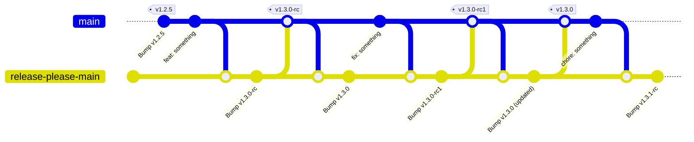
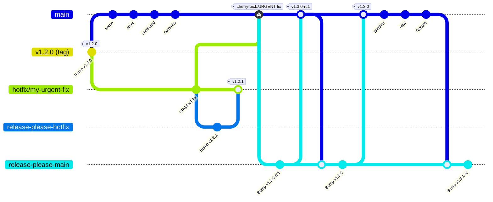

# Gestion des versions

Ce document décrit comment est géré le versionnement de `console`, c'est-à-dire :

- Préparer les préversions et les versions stables de `console`
- Créer effectivement les versions correspondantes dans GitHub
- Mettre à jour le chart Helm `dso-console`
- Publier les nouvelles versions de modules NPM concernés

## Incrémentation des versions

Afin d'éviter une confusion entre les correctifs d'urgence ("hotfixes") — historiquement des versions `PATCH` rétroportées sur `main` — et les versions régulières produites par des commits `fix:`, les versions stables adoptent le protocole suivant :

- Les versions régulières sur `main` sont par défaut des `MINOR` (et très rarement des `MAJOR`).
- Une préversion utilise la **prochaine** version stable visée, suffixée par `-rc`, puis `-rc.N` pour les candidates suivantes. Par exemple:
  - Si la dernière version publiée est la `9.24.5`, la préversion (RC) suivante sera la `9.25.0-rc`
  - Si la dernière version publiée est la `9.32.0-rc2`, la préversion suivante sera la `9.32.0-rc3`
- Les correctifs d'urgence sont forcément des versions `PATCH`, créées depuis une branche `hotfix/<slug>` issue du tag stable à corriger ; voir la section [Correctifs d'urgence](#correctifs_durgence).

La structure de versionnement stable de `console` est donc :
- Versions "stables" : **`MAJOR`.`MINOR`.`0`**
- Préversions (ou "release candidates") : **`MAJOR`.`MINOR`.`0`-rc** ou **`MAJOR`.`MINOR`.`0`-rc.`INCREMENT`**
- Correctifs d'urgenc (ou "hotfixes") : **`MAJOR`.`MINOR`.`HOTFIX`, où `HOTFIX` est un nombre strictement supérieur à `1`

## Schéma récapitulatif

Les sections suivantes vont expliciter ce schéma:



## Versionnement de Console

Le flux de travail [`Handle next prerelease or release`](https://github.com/cloud-pi-native/console/blob/main/.github/workflows/workflow-handle-main.yml) est déclenché à chaque nouveau commit sur `main`. Il utilise le job réutilisable [`Next Prerelease and Release`](https://github.com/cloud-pi-native/console/blob/main/.github/workflows/job-release-please.yml) et notamment la GitHub Action [release-please-action](https://github.com/googleapis/release-please-action).

Le flux de travail [`Handle next hotfix`](https://github.com/cloud-pi-native/console/blob/main/.github/workflows/workflow-handle-hotfix.yml) est déclenché à chaque nouveau commit sur une branche `hotfix/*`. Il utilise le job réutilisable [`Next Hotfix`](https://github.com/cloud-pi-native/console/blob/main/.github/workflows/job-release-please-hotfixes.yml).

Trois configurations isolent les états de version :

- [`.github/prerelease-please-config.json`](./.github/prerelease-please-config.json) et son [manifeste](./.github/prerelease-please-manifest.json) gèrent les préversions (ou "Release Candidates", usuellement dénotées "RC") ;
- [`.github/release-please-config.json`](./.github/release-please-config.json) et son [manifeste](./.github/release-please-manifest.json) gèrent les versions "stables". La version stable met aussi à jour le manifeste de préversion afin de réinitialiser le cycle suivant depuis cette version (si on était à la `-rc14`, on réinitialise à `-rc` pour la prochaine version) ;
- [`.github/hotfix-release-please-config.json`](./.github/hotfix-release-please-config.json) et le manifeste de version stable gèrent les correctifs d'urgence. Cette configuration n'écrit jamais dans le manifeste de préversion.

À chaque exécution, le job `prepare` finalise d'abord toute requête de fusion de version déjà fusionnée, puis crée ou met à jour la prochaine requête de fusion.
Plus concrètement, le cycle est le suivant :

1. Les commits classiques (`feat`, `chore`, etc.) sur `main` déclenchent les workflows GitHub qui vont créer/mettre à jour une MR de préversion.
2. La fusion de cette MR dans `main` crée effectivement la préversion:
  a. Création du tag git `vX.Y.Z-rc`. Les RC suivantes de la même version sont taguées `vX.Y.Z-rc.N`, où `N` vaut `1`, puis `2`, etc.
  b. Création des images OCI/docker poussées en tant que "packages" dans l'organisation GitHub `cloud-pi-native`
  c. Création de la Release GitHub, avec cependant une étiquette `Pre-release` pour indiquer que ce n'est pas une version "stable". Ce n'est, par exemple, pas la version qui est affichée sur la page de garde du dépôt
  d. Création de la MR côté `helm-chart` qui va faire un bump mineur du chart `dso-console` avec comme `appVersion` la version RC nouvellement créée (il faudra alors fusionner cette MR pour avoir un chart à jour)
3. Après la création de la préversion, vu que son commit de "bump" de version a été poussé sur `main`, les workflows sont à nouveaux déclenchés et une MR de version stable `vX.Y.Z` est créée.
4. La fusion de cette MR crée la Release GitHub stable `vX.Y.Z`
5. Tout nouveau commit classique poussé sur `main` déclenchera la création de la prochaine MR de préversion (retour à l'étape 1)

**⚠️NOTE⚠️**: Si jamais, après l'étape `3` (création de la MR pour la version stable) des commits "classiques" sont poussés sur `main` alors **la MR de la version stable sera automatiquement "convertie" en MR de préversion**. Dit autrement: **On ne peut créer une version "stable" qu'à partir d'une préversion**. Tout commit en plus empêche d'avoir une version stable, il faut forcément qu'il y ait ZERO commit après une préversion pour avoir une MR de version stable.

Les différents types de commits (`chore:`, `feat:`, `fix:`, etc.) alimentent les sections du `CHANGELOG.md` selon les deux configurations release-please ci-dessus.

Lorsqu'une préversion ou une version stable est créée, les images de conteneur des applications (`client`, `server`, etc.) sont publiées dans la [registry GitHub du dépôt](https://github.com/orgs/cloud-pi-native/packages?repo_name=console) avec le tag complet correspondant. Une version stable met aussi à jour les tags partiels `vX` et `vX.Y` ; ⚠️ Les RC ne touchent **jamais** à ces tags "mouvants". Ils sont là explicitement pour traquer la dernière version stable, majeure ou mineure.

> Les tags complets (`vX.Y.Z`, `vX.Y.Z-rc` et `vX.Y.Z-rc.N`) sont immutables. Seuls les tags partiels stables (`vX` et `vX.Y`) sont recréés pour référencer la dernière version stable. Après une version stable, il est recommandé d'exécuter `git pull --tags --force` afin de recréer localement ces tags partiels.

## Versionnement du chart Helm `dso-console`

Le déploiement de `console` se fait préférablement à l'aide de son chart Helm, nommé [`dso-console`](https://github.com/cloud-pi-native/helm-charts/tree/main/charts/dso-console).

Lorsqu'une RC, une version stable ou un correctif d'urgence est créé, le flux de travail déclenche automatiquement une requête de fusion dans le dépôt `helm-charts` afin de mettre à jour le chart Helm `dso-console` avec l'`APP_VERSION` complète correspondante. Une fusion manuelle sur ce dépôt reste nécessaire pour publier la nouvelle version du chart. Exemple de requête de fusion : https://github.com/cloud-pi-native/helm-charts/pull/204.

> Une RC, une version stable et un correctif d'urgence produisent le même type de requête de fusion côté `helm-charts`. Le chart référence cependant l'`APP_VERSION` complète : une RC conserve donc son suffixe `-rc` ou `-rc.N`.

## Versionnement des modules NPM

La publication des nouvelles versions de modules npm du dépôt est automatique et est inclus dans le flux de travail de création d'une nouvelle version. Il analyse les numéros de version présents dans les différents fichiers `package.json` pour déterminer si une nouvelle version du module doit être créée et publiée.

> Il est possible de créer une version de préversion d'un module npm en modifiant la clé `publishConfig.tag` dans le `package.json` avec par exemple `beta` pour générer une version beta.

## Correctifs d'urgence

Un correctif d'urgence est réservé, comme son nom l'indique, à la correction urgente d'une version stable déjà livrée. **La correction "en avant" ("fix forward") sur `main` reste cependant la solution privilégiée lorsque le délai le permet**.

Schéma récapitulatif :



### Règles de sécurité

- La branche de correctif part toujours d'un tag de version stable effectivement déployé quelque part, **jamais de `main` ni d'une RC**.
- Un seul correctif est traité à la fois pour une même version stable.
- La branche suit le format `correctif/<slug>` ; le motif de déclenchement actuel ne couvre pas les éventuelles sous-branches (`hotfix/sub/fix`).
- La branche de correctif et sa MR `release-please` ne doivent **JAMAIS** être fusionnées dans `main`. Seuls les commits applicatifs sont ensuite picorés ("cherry-picking") dans `main`.

### Procédure

Exemple : corriger la version de production `v9.24.5`.

1. Vérifier le tag cible et créer la branche :

   ```bash
   git fetch origin --tags
   git switch --detach v9.24.5
   git switch -c hotfix/urgent-<description>
   ```

2. Implémenter et valider le correctif, puis pousser la branche.

3. Vérifier que le workflow `Handle next hotfix` crée une MR `release-please` ciblant `hotfix/urgent-<description>` et proposant exactement `v9.24.6`. En cas de version, branche cible, ou liste de changement ("changelog") inattendus, **ne pas fusionner la MR**.

4. Fusionner la MR `release-please` après validation. Cela crée le tag et la GitHub Release `v9.24.6`, publie les images OCI taguées `v9.24.6` et déclenche la demande de mise à jour du chart `dso-console` avec `appVersion: 9.24.6`.

5. Déployer le chart mis à jour, puis vérifier que la version déployée est bien `9.24.6`.

6. Créer une MR vers `main` en picorant ("cherry-picking") exclusivement le ou les commits applicatif du correctif d'urgence. Exclure les commits automatiques `release-please`, le `CHANGELOG.md`, les manifestes et les fichiers de version. Le correctif intègre alors normalement le cycle préversion/version stable en cours sur `main`.

> Une préversion en cours sur `main` reste indépendante d'un correctif d'urgence. Par exemple, un correctif d'urgence `9.24.6` ne modifie ni la cible ni le compteur des RC `9.25.0-rc.*`.
