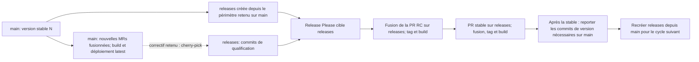
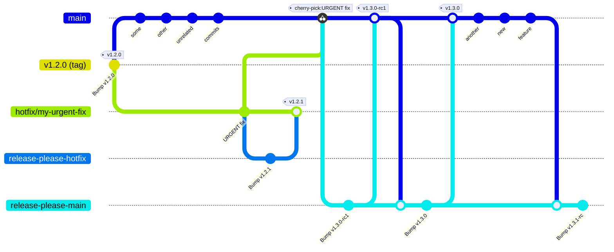

# Gestion des versions

Ce document décrit comment est géré le versionnement de `console`, c'est-à-dire :

- Préparer les préversions et les versions stables de `console`
- Créer effectivement les versions correspondantes dans GitHub
- Mettre à jour le chart Helm `dso-console`
- Publier les nouvelles versions de modules NPM concernés

## Incrémentation des versions

Afin d'éviter une confusion entre les correctifs d'urgence ("hotfixes") — historiquement des versions `PATCH` rétroportées sur `main` — et les versions régulières produites par des commits `fix:`, les versions stables adoptent le protocole suivant :

- Les versions régulières sur `releases` sont par défaut des `MINOR` (et très rarement des `MAJOR`).
- Une préversion utilise la **prochaine** version stable visée, suffixée par `-rc`, puis `-rc.N` pour les candidates suivantes. Par exemple:
  - Si la dernière version publiée est la `9.24.5`, la préversion (RC) suivante sera la `9.25.0-rc`
  - Si la dernière version publiée est la `9.32.0-rc2`, la préversion suivante sera la `9.32.0-rc3`
- Les correctifs d'urgence sont forcément des versions `PATCH`, créées depuis une branche `hotfix/<slug>` issue du tag stable à corriger ; voir la section [Correctifs d'urgence](#correctifs_durgence).

La structure de versionnement stable de `console` est donc :
- Versions "stables" : **`MAJOR`.`MINOR`.`0`**
- Préversions (ou "release candidates") : **`MAJOR`.`MINOR`.`0`-rc** ou **`MAJOR`.`MINOR`.`0`-rc.`INCREMENT`**
- Correctifs d'urgenc (ou "hotfixes") : **`MAJOR`.`MINOR`.`HOTFIX`, où `HOTFIX` est un nombre strictement supérieur à `1`

## Schéma récapitulatif

Les sections suivantes vont expliciter ce schéma:


```mermaid
flowchart LR
    M0["main: version stable N"] --> M1["main: nouvelles MRs fusionnées; build et déploiement latest"]
    M0 --> R0["releases créée depuis le périmètre retenu sur main"]
    M1 -. "correctif retenu : cherry-pick" .-> R1["releases: commits de qualification"]
    R0 --> RP["Release Please cible releases"]
    R1 --> RP
    RP --> RC["Fusion de la PR RC sur releases; tag et build"]
    RC --> ST["PR stable sur releases; fusion, tag et build"]
    ST --> BACK["Après la stable : reporter les commits de version nécessaires sur main"]
    BACK --> NEXT["Recréer releases depuis main pour le cycle suivant"]
```

## Versionnement de Console

Le flux [`Build and deploy latest from main`](https://github.com/cloud-pi-native/console/blob/main/.github/workflows/workflow-handle-main.yml) est déclenché à chaque push sur `main`. Il construit la version d'intégration et déploie `latest`; il ne déclenche pas Release Please.

Le flux [`Handle next prerelease or release`](https://github.com/cloud-pi-native/console/blob/main/.github/workflows/workflow-handle-releases.yml) est déclenché à chaque push sur `releases`. Il appelle le job réutilisable [`Next Prerelease and Release`](https://github.com/cloud-pi-native/console/blob/main/.github/workflows/job-release-please.yml), avec `releases` comme branche cible pour les PR RC et stable. Les tags RC et stables déclenchent les builds d'artefacts et la mise à jour du chart. Le job de déploiement `latest` reste réservé aux événements de `main`.

Le flux [`Handle next hotfix`](https://github.com/cloud-pi-native/console/blob/main/.github/workflows/workflow-handle-hotfix.yml) est déclenché à chaque nouveau commit sur une branche `hotfix/*`. Il utilise le job réutilisable [`Next Hotfix`](https://github.com/cloud-pi-native/console/blob/main/.github/workflows/job-release-please-hotfixes.yml).

Trois configurations isolent les états de version :

- [`.github/prerelease-please-config.json`](./.github/prerelease-please-config.json) et son [manifeste](./.github/prerelease-please-manifest.json) gèrent les préversions (ou "Release Candidates", usuellement dénotées "RC") sur `releases` ;
- [`.github/release-please-config.json`](./.github/release-please-config.json) et son [manifeste](./.github/release-please-manifest.json) gèrent les versions stables sur `releases`. La version stable met aussi à jour le manifeste de préversion afin de réinitialiser le cycle suivant depuis cette version (si on était à la `-rc14`, on réinitialise à `-rc` pour la prochaine version) ;
- [`.github/hotfix-release-please-config.json`](./.github/hotfix-release-please-config.json) et le manifeste de version stable gèrent les correctifs d'urgence. Cette configuration n'écrit jamais dans le manifeste de préversion.

À chaque push sur `releases`, le job `prepare` finalise d'abord toute PR de version déjà fusionnée, puis crée ou met à jour la prochaine PR Release Please. Le cycle manuel est le suivant :

1. Au début d'une qualification, créer `releases` depuis le commit de `main` qui définit le périmètre de la version et pousser cette branche. Pour la bascule du cycle existant, fermer sans la fusionner l'ancienne PR Release Please qui cible `main`, puis créer `releases` depuis l'état de `main` contenant la dernière RC publiée. Release Please crée alors la PR de version sur `releases`.
2. Fusionner les MRs fonctionnelles sur `main` comme d'habitude. Elles continuent à alimenter le build et le déploiement `latest`, sans créer de RC.
3. Pour inclure une correction dans la version en qualification, cherry-picker son commit de `main` sur `releases`. Release Please crée ou met à jour la PR RC ciblant `releases`.
4. Fusionner la PR RC sur `releases` pour créer le tag `vX.Y.Z-rc` ou `vX.Y.Z-rc.N`, la Release GitHub « Pre-release » et les builds d'artefacts correspondants. Le flux existant déclenche également la mise à jour du chart Helm.
5. Après une RC, Release Please crée ou met à jour la PR de version stable `vX.Y.Z`, toujours ciblant `releases`. La fusion de cette PR crée le tag et la Release GitHub stables, les builds d'artefacts et les tags partiels `vX` et `vX.Y`.
6. Après la stable, reporter sur `main` uniquement les commits de version/release nécessaires qui ne s'y trouvent pas déjà. Ne pas fusionner l'ensemble de `releases`, qui contient des cherry-picks de commits déjà présents sur `main`. Supprimer ensuite `releases` et la recréer depuis `main` au début de la qualification suivante.

Les commits qui ne sont pas cherry-pickés sur `releases` restent hors du périmètre de la version en qualification. Le cycle de Release Please régulier ne démarre pas depuis `main`.

## Notes de version

`release-please` gère les incréments de version, les requêtes de fusion de release, les tags immuables et les GitHub Releases. Il ne génère pas de fichier `CHANGELOG.md`.

L’historique généré avant cette bascule est conservé, sans modification, dans [`CHANGELOGS/CHANGELOG_ARCHIVE.md`](./CHANGELOGS/CHANGELOG_ARCHIVE.md). Les notes destinées aux utilisateurs sont préparées manuellement avec le skill [`cpn-release-notes`](./.agents/skills/cpn-release-notes/SKILL.md) : il produit `CHANGELOGS/<version>.md` et son audit non publiable `CHANGELOGS/<version>.anomalies.md`.

La procédure collecte la version stable cible, le tag candidat, le milestone exact et la MR Helm. Elle réconcilie ces preuves, présente une prévisualisation et n’écrit les fichiers qu’après validation humaine. L’absence de tag, de milestone ou de MR Helm bloque la préparation. Cette bascule n’ajoute ni contrôle CI ni automatisation par agent.

Lorsqu'une préversion ou une version stable est créée, les images de conteneur des applications (`client`, `server`, etc.) sont publiées dans la [registry GitHub du dépôt](https://github.com/orgs/cloud-pi-native/packages?repo_name=console) avec le tag complet correspondant. Une version stable met aussi à jour les tags partiels `vX` et `vX.Y` ; ⚠️ Les RC ne touchent **jamais** à ces tags "mouvants". Ils sont là explicitement pour traquer la dernière version stable, majeure ou mineure.

> Les tags complets (`vX.Y.Z`, `vX.Y.Z-rc` et `vX.Y.Z-rc.N`) sont immutables. Seuls les tags partiels stables (`vX` et `vX.Y`) sont recréés pour référencer la dernière version stable. Après une version stable, il est recommandé d'exécuter `git pull --tags --force` afin de recréer localement ces tags partiels.

## Versionnement du chart Helm `dso-console`

Le déploiement de `console` se fait préférablement à l'aide de son chart Helm, nommé [`dso-console`](https://github.com/cloud-pi-native/helm-charts/tree/main/charts/dso-console).

Lorsqu'une RC, une version stable ou un correctif d'urgence est créé, le flux de travail déclenche automatiquement une requête de fusion dans le dépôt `helm-charts` afin de mettre à jour le chart Helm `dso-console` avec l'`APP_VERSION` complète correspondante. Une fusion manuelle sur ce dépôt reste nécessaire pour publier la nouvelle version du chart. Exemple de requête de fusion : https://github.com/cloud-pi-native/helm-charts/pull/204.

> Une RC, une version stable et un correctif d'urgence produisent le même type de requête de fusion côté `helm-charts`. Le chart référence cependant l'`APP_VERSION` complète : une RC conserve donc son suffixe `-rc` ou `-rc.N`.

## Versionnement des modules NPM

La publication des nouvelles versions de modules npm du dépôt est automatique et est inclus dans le flux de travail de création d'une nouvelle version. Il analyse les numéros de version présents dans les différents fichiers `package.json` pour déterminer si une nouvelle version du module doit être créée et publiée.

> Il est possible de créer une version de préversion d'un module npm en modifiant la clé `publishConfig.tag` dans le `package.json` avec par exemple `beta` pour générer une version beta.

## Correctifs d'urgence

Un correctif d'urgence est réservé, comme son nom l'indique, à la correction urgente d'une version stable déjà livrée. **La correction "en avant" ("fix forward") sur `main` reste cependant la solution privilégiée lorsque le délai le permet**.

Schéma récapitulatif :


```mermaid
gitGraph
    commit id: "Bump v1.2.0" tag: "v1.2.0"
    %% Initial state: latest tag on main = v1.2.5
    branch "v1.2.0 (tag)"
    commit id: "Bump v1.2.0" tag: "v1.2.0"
    checkout main
    commit id: "some"
    commit id: "other"
    commit id: "unrelated"
    commit id: "commits"

    %% Some commits are added to new hotfix branch
    checkout "v1.2.0 (tag)"
    branch hotfix/my-urgent-fix
    commit id: "URGENT fix"

   %% Job create-or-update-release triggers release-please
   %% which will upsert the next release MR, which will be a prerelease
    branch release-please-hotfix
    commit id: "Bump v1.2.1"

    %% Upon merging the release-please MR
    %% The new tag is created
    checkout hotfix/my-urgent-fix
    merge release-please-hotfix tag: "v1.2.1"

    %% IF new commits are added BEFORE merging the release-please MR,
    %% a new prerelease MR will replace the stable release MR
    checkout main
    cherry-pick id: "URGENT fix"
    branch release-please-main
    commit id: "Bump v1.3.0-rc1"

    %% Upon merging the release-please MR
    %% The new tag is created
    checkout main
    merge release-please-main tag: "v1.3.0-rc1"
    %% and the release-please MR for the next stable release is created
    checkout release-please-main
    merge main
    commit id: "Bump v1.3.0"

   %% IF the stable release MR is merged into main
    checkout main
    merge release-please-main tag: "v1.3.0"

    %% New commits are then pushed to main
    %% and the cycle starts anew
    commit id: "another"
    commit id: "new"
    commit id: "feature"

   %% Job create-or-update-release triggers release-please
   %% which will upsert the next release MR, which will be a prerelease
    checkout release-please-main
    merge main
    commit id: "Bump v1.3.1-rc"
```

### Règles de sécurité

- La branche de correctif part toujours d'un tag de version stable effectivement déployé quelque part, **jamais de `main` ni d'une RC**.
- Un seul correctif est traité à la fois pour une même version stable.
- La branche suit le format `correctif/<slug>` ; le motif de déclenchement actuel ne couvre pas les éventuelles sous-branches (`hotfix/sub/fix`).
- La branche de correctif et sa MR `release-please` ne doivent **JAMAIS** être fusionnées dans `main`. Seuls les commits applicatifs sont ensuite picorés ("cherry-picking") dans `main`.

### Procédure

Exemple : corriger la version de production `v9.24.5`.

1. Vérifier le tag cible et créer la branche :

   ```bash
   git fetch origin --tags
   git switch --detach v9.24.5
   git switch -c hotfix/urgent-<description>
   ```

2. Implémenter et valider le correctif, puis pousser la branche.

3. Vérifier que le workflow `Handle next hotfix` crée une MR `release-please` ciblant `hotfix/urgent-<description>` et proposant exactement `v9.24.6`. En cas de version, branche cible, ou liste de changement ("changelog") inattendus, **ne pas fusionner la MR**.

4. Fusionner la MR `release-please` après validation. Cela crée le tag et la GitHub Release `v9.24.6`, publie les images OCI taguées `v9.24.6` et déclenche la demande de mise à jour du chart `dso-console` avec `appVersion: 9.24.6`.

5. Déployer le chart mis à jour, puis vérifier que la version déployée est bien `9.24.6`.

6. Créer une MR vers `main` en picorant ("cherry-picking") exclusivement le ou les commits applicatif du correctif d'urgence. Exclure les commits automatiques `release-please`, le `CHANGELOG.md`, les manifestes et les fichiers de version. Le correctif intègre alors normalement le cycle préversion/version stable en cours sur `main`.

> Une préversion en cours sur `main` reste indépendante d'un correctif d'urgence. Par exemple, un correctif d'urgence `9.24.6` ne modifie ni la cible ni le compteur des RC `9.25.0-rc.*`.
