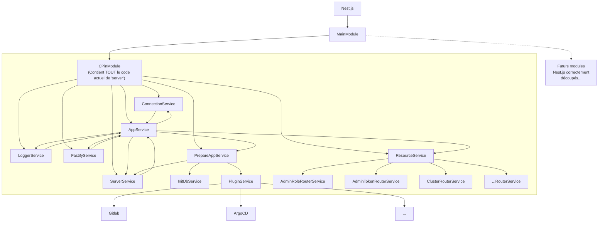

# À propos

Ce dossier contient une nouvelle version de `server`, basée sur NestJS.

## Objectifs

Rappel : L'objectif principal de cette démarche est de préparer l'extraction de
chaque "plugin" en tant que module NestJS incluant à la fois la partie Front et
la partie Backend pour une meilleure composition de la Console.

On va profiter de cette vision pour passer, côté `server` d'un "Back For
Front", à un backend qui va gérer à la fois le Front et le Back de différentes
fonctionnalités (appelée "Plugins"), et ce parfois de manière dynamique (mais
déjà en statique, ce sera pas mal 😅).


## Conséquences pour apps/server

On va donc passer de ça :



à ça :

```mermaid
flowchart TD

    %% --- Top-level Nest module ---
    NestJS["Point d'entrée de NestJS"]
    MainModule["MainModule"]
    CPinModule["CPinModule"]
    FutursModules["Futurs modules<br/>NestJS correctement<br/>découpés..."]

    NestJS --> MainModule
    MainModule --> CPinModule
    MainModule -.-> FutursModules

    %% --- Layering for clarity ---
    subgraph LayerInit["Initialisation de l'application"]
        ApplicationInitializationService["ApplicationInitializationService"]
        DatabaseInitializationService["DatabaseInitializationService"]
        PluginManagementService["PluginManagementService"]
    end

    subgraph LayerCore["Coeur de l'application"]
        AppService["AppService"]
        RouterService["RouterService"]
        ServerService["ServerService"]
    end

    subgraph LayerInfra["Couche Infrastructure"]
        LoggerService["LoggerService"]
        ConfigurationService["ConfigurationService"]
        DatabaseService["DatabaseService"]
        FastifyService["FastifyService"]
        HTTPClientService["HTTPClientService"]
    end

    OtherAPIService["APIs externes</br>(par ex. OpenCDS)"]
    HTTPClientService --> OtherAPIService

    subgraph LayerBusiness["Modules métiers"]
        subgraph AdminRole["Admin Roles"]
            AdminRoleRouterService["AdminRoleRouterService"]
            AdminRoleBusinessService["AdminRoleBusinessService"]
            AdminRoleDTOService["AdminRoleDTOService"]
            AdminRoleRouterService --> AdminRoleBusinessService
            AdminRoleRouterService --> LoggerService
            AdminRoleBusinessService --> AdminRoleDTOService
            AdminRoleBusinessService --> LoggerService
            AdminRoleDTOService --> LoggerService
            AdminRoleDTOService --> DatabaseService
        end
        subgraph AdminToken["Admin Tokens"]
            AdminTokenRouterService["AdminTokenRouterService"]
            AdminTokenBusinessService["AdminTokenBusinessService"]
            AdminTokenDTOService["AdminTokenDTOService"]
            AdminTokenRouterService --> AdminTokenBusinessService
            AdminTokenRouterService --> LoggerService
            AdminTokenBusinessService --> AdminTokenDTOService
            AdminTokenBusinessService --> LoggerService
            AdminTokenDTOService --> DatabaseService
            AdminTokenDTOService --> LoggerService
        end
        subgraph ServiceChain["Service chains"]
            ServiceChainRouterService["ServiceChainRouterService"]
            ServiceChainBusinessService["ServiceChainBusinessService"]
            ServiceChainRouterService --> ServiceChainBusinessService
            ServiceChainRouterService --> LoggerService
            ServiceChainBusinessService --> HTTPClientService
            ServiceChainBusinessService --> LoggerService

        end
        subgraph Cluster["Clusters"]
            ClusterRouterService["ClusterRouterService"]
            ClusterBusinessService["ClusterBusinessService"]
            ClusterDTOService["ClusterDTOService"]
            ClusterRouterService --> ClusterBusinessService
            ClusterRouterService --> LoggerService
            ClusterBusinessService --> ClusterDTOService
            ClusterBusinessService --> LoggerService
            ClusterDTOService --> DatabaseService
            ClusterDTOService --> LoggerService
        end
        OtherBusinessModules["...Other Business Modules"]
    end

    RouterService --> AdminRoleRouterService
    RouterService --> AdminTokenRouterService
    RouterService --> ClusterRouterService
    RouterService --> ServiceChainRouterService
    RouterService --> OtherBusinessModules
    RouterService --> LoggerService

    subgraph LayerPlugins["Plugins compatibles CPiN"]
        Gitlab["Gitlab"]
        ArgoCD["ArgoCD"]
        Kubernetes["Kubernetes"]
        Dots["..."]
    end

    %% --- Module wiring ---
    CPinModule --> ApplicationInitializationService

    %% Application initialization
    ApplicationInitializationService --> LoggerService
    ApplicationInitializationService --> ConfigurationService
    ApplicationInitializationService --> FastifyService
    ApplicationInitializationService --> AppService
    ApplicationInitializationService --> DatabaseInitializationService
    DatabaseInitializationService --> DatabaseService
    DatabaseInitializationService --> LoggerService
    ApplicationInitializationService --> PluginManagementService
    ApplicationInitializationService --> LoggerService

    %% App Core internal flow
    AppService --> RouterService
    AppService --> ServerService
    AppService --> LoggerService
    ServerService --> LoggerService

    %% Plugin Management
    PluginManagementService --> Gitlab
    PluginManagementService --> ArgoCD
    PluginManagementService --> Kubernetes
    PluginManagementService --> Dots
    PluginManagementService --> LoggerService
    Gitlab --> LoggerService
    ArgoCD --> LoggerService
    Kubernetes --> LoggerService
    Dots --> LoggerService
```



Pour mettre à jour `old-server` (après avoir rebasé sur `origin/master`, par exemple) :

```bash
server-nestjs/$ rm -rf src/cpin-module/old-server
server-nestjs/$ cp -r ../server src/cpin-module/old-server
server-nestjs/$ find src/cpin-module/old-server -type f -iname "*.ts" -exec sed -i -e "s#@/#@old-server/#g" {} \;
server-nestjs/$ find src/cpin-module/old-server -type f -iname "*.ts" -exec sed -i -e "s#\.[jt]s'#'#g" {} \;
```

## Fichiers à supprimer dans le futur

Certains fichiers de `old-server` servait de "framework" pour le backend, et
vont donc être réécrits en tant que modules/services NestJS. On va garder la
liste ici, ce qui permettra de ne pas être constamment en conflit sur le code
de `server`. En attendant de pouvoir s'en débarrasser, et afin de s'assurer que
leur code n'est pas utilisé dans d'autres parties du backend, on va commenter
l'intégralité de ces fichiers (comme ça pas d'erreur d'import quand on les
supprimera).


Voilà donc la liste des fichiers "dépréciés" :

```
old-server/src/app.ts -> Réécrit en AppService
old-server/src/connect.ts -> Réécrit en DatabaseService
old-server/src/init/db/* (à part dump.ts) -> Réécrit en DatabaseInitializationService
old-server/src/resources/**/router.ts -> Réécrit en **RouterService
old-server/src/resources/index.ts -> Réécrit en RouterService
old-server/src/server.ts -> Intégré à ApplicationInitializationService
old-server/src/utils/env.ts -> Réécrit en ConfigurationModule
old-server/src/utils/fastify.ts -> Réécrit en FastifyService
old-server/src/utils/keycloak-utils.ts -> Intégré dans AppService
old-server/src/utils/keycloak.ts -> Intégré dans AppService
old-server/src/utils/logger.ts -> Réécrit en LoggerModule
old-server/src/utils/plugin.ts -> Réécrit en PluginManagementService
```

## Prochaines itérations sur le sujet

Tâches à réaliser par la suite dans d'autres itérations/tickets/etc. :

- Migrer une fonctionnalité "verticale" complète (Route, Contract, Controller,
  Business, Queries, Prisma schema) dans son propre module NestJS qui sera
  importé dans `MainModule` (et pas dans `CpinModule` qui devra disparaître
  à terme).
- Définir la liste de ces fonctionnalités verticales, et planifier l'extraction
  de certaines d'entre elles (OpenCDS, typiquement, qui n'a rien à faire dans
  le code de base de la Console)
- Migrer la base actuelle de NestJS de Jest vers Vitest et s'assurer que les
  tests unitaires passent à nouveaux (attention, certains d'entre eux devront
  être adaptés vu qu'on a commencé à réécrire du code au standard NestJS)
- Intérgrer `server-nestjs` dans tous les `docker compose` et les différents
  scripts PNPM/Bash qui font tout le sel de nos process de dev
- Revoir les imports de données (le fameux `dump.ts`). C'était déjà une
  mauvaise idée à l'époque, ça l'est encore plus aujourd'hui. On ferait mieux
  d'utiliser un side-container pour ça
- Être capable de déployer `server-nestjs` en parallèle de `server`, avec
  probablement un reverse proxy dédié à la migration des routes de l'ancien
  vers le nouveau (à rediscuter plus concrètement)

Les étapes d'après-après (quand on sera sereins sur la migration de `server`
vers `server-nestjs`) :

- Tester les capacités de NestJS SSR (Server Side Rendering), notamment
  vis-à-vis de nos composants VueJS. Il y aura probablement des sujets autour
  de l'isolation du code VueJS des différentes fonctionnalités afin de
  faciliter leur extraction de `client` vers `server`
- Implémenter une fonctionnalité du Front en tant que module NestJS SSR
  (OpenCDS est un très bon cas d'étude grâce à son côté très isolé dans le
  code). Idéalement ce code "Front" ajouté "côté Backend" devra être colocalisé
  avec le code "Backend" correspondant.
