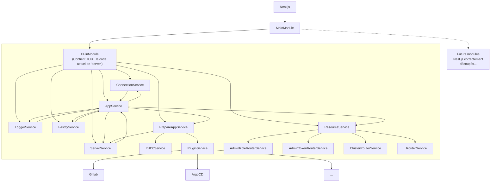

# À propos

Ce dossier contient une nouvelle version de `server`, basée sur NestJS.

On va profiter de cette nouvelle mouture pour passer de ça :



à ça :

```mermaid
flowchart TD

    %% --- Top-level Nest module ---
    NestJS["Point d'entrée de NestJS"]
    MainModule["MainModule"]
    CPinModule["CPinModule"]
    FutursModules["Futurs modules<br/>NestJS correctement<br/>découpés..."]

    NestJS --> MainModule
    MainModule --> CPinModule
    MainModule -.-> FutursModules

    %% --- Layering for clarity ---
    subgraph LayerInit["Initialisation de l'application"]
        ApplicationInitializationService["ApplicationInitializationService"]
        DatabaseInitializationService["DatabaseInitializationService"]
        PluginManagementService["PluginManagementService"]
    end

    subgraph LayerCore["Coeur de l'application"]
        AppService["AppService"]
        RouterService["RouterService"]
        ServerService["ServerService"]
    end

    subgraph LayerInfra["Couche Infrastructure"]
        LoggerService["LoggerService"]
        ConfigurationService["ConfigurationService"]
        DatabaseService["DatabaseService"]
        FastifyService["FastifyService"]
        HTTPClientService["HTTPClientService"]
    end

    OtherAPIService["APIs externes</br>(par ex. OpenCDS)"]
    HTTPClientService --> OtherAPIService

    subgraph LayerBusiness["Modules métiers"]
        subgraph AdminRole["Admin Roles"]
            AdminRoleRouterService["AdminRoleRouterService"]
            AdminRoleBusinessService["AdminRoleBusinessService"]
            AdminRoleDTOService["AdminRoleDTOService"]
            AdminRoleRouterService --> AdminRoleBusinessService
            AdminRoleRouterService --> LoggerService
            AdminRoleBusinessService --> AdminRoleDTOService
            AdminRoleBusinessService --> LoggerService
            AdminRoleDTOService --> LoggerService
            AdminRoleDTOService --> DatabaseService
        end
        subgraph AdminToken["Admin Tokens"]
            AdminTokenRouterService["AdminTokenRouterService"]
            AdminTokenBusinessService["AdminTokenBusinessService"]
            AdminTokenDTOService["AdminTokenDTOService"]
            AdminTokenRouterService --> AdminTokenBusinessService
            AdminTokenRouterService --> LoggerService
            AdminTokenBusinessService --> AdminTokenDTOService
            AdminTokenBusinessService --> LoggerService
            AdminTokenDTOService --> DatabaseService
            AdminTokenDTOService --> LoggerService
        end
        subgraph ServiceChain["Service chains"]
            ServiceChainRouterService["ServiceChainRouterService"]
            ServiceChainBusinessService["ServiceChainBusinessService"]
            ServiceChainRouterService --> ServiceChainBusinessService
            ServiceChainRouterService --> LoggerService
            ServiceChainBusinessService --> HTTPClientService
            ServiceChainBusinessService --> LoggerService

        end
        subgraph Cluster["Clusters"]
            ClusterRouterService["ClusterRouterService"]
            ClusterBusinessService["ClusterBusinessService"]
            ClusterDTOService["ClusterDTOService"]
            ClusterRouterService --> ClusterBusinessService
            ClusterRouterService --> LoggerService
            ClusterBusinessService --> ClusterDTOService
            ClusterBusinessService --> LoggerService
            ClusterDTOService --> DatabaseService
            ClusterDTOService --> LoggerService
        end
        OtherBusinessModules["...Other Business Modules"]
    end

    RouterService --> AdminRoleRouterService
    RouterService --> AdminTokenRouterService
    RouterService --> ClusterRouterService
    RouterService --> ServiceChainRouterService
    RouterService --> OtherBusinessModules
    RouterService --> LoggerService

    subgraph LayerPlugins["Plugins compatibles CPiN"]
        Gitlab["Gitlab"]
        ArgoCD["ArgoCD"]
        Kubernetes["Kubernetes"]
        Dots["..."]
    end

    %% --- Module wiring ---
    CPinModule --> ApplicationInitializationService

    %% Application initialization
    ApplicationInitializationService --> LoggerService
    ApplicationInitializationService --> ConfigurationService
    ApplicationInitializationService --> FastifyService
    ApplicationInitializationService --> AppService
    ApplicationInitializationService --> DatabaseInitializationService
    DatabaseInitializationService --> DatabaseService
    DatabaseInitializationService --> LoggerService
    ApplicationInitializationService --> PluginManagementService
    ApplicationInitializationService --> LoggerService

    %% App Core internal flow
    AppService --> RouterService
    AppService --> ServerService
    AppService --> LoggerService
    ServerService --> LoggerService

    %% Plugin Management
    PluginManagementService --> Gitlab
    PluginManagementService --> ArgoCD
    PluginManagementService --> Kubernetes
    PluginManagementService --> Dots
    PluginManagementService --> LoggerService
    Gitlab --> LoggerService
    ArgoCD --> LoggerService
    Kubernetes --> LoggerService
    Dots --> LoggerService
```



To update `old-server` (after rebasing on `origin/master`, for instance) :

```bash
server-nestjs/$ rm -rf src/cpin-module/old-server
server-nestjs/$ cp -r ../server src/cpin-module/old-server
server-nestjs/$ find src/cpin-module/old-server -type f -iname "*.ts" -exec sed -i -e "s#@/#@old-server/#g" {} \;
server-nestjs/$ find src/cpin-module/old-server -type f -iname "*.ts" -exec sed -i -e "s#\.[jt]s'#'#g" {} \;
```

## To delete (once we have a sastifying nestjs implementation):

Some `old-server` files are being rewritten and incorporated as NestJS modules.
We will keep track of them here so that we can go back and forth between the previous
implementation and the future NestJS one. In the meantime their code is commented out
in order to show if they can be safely removed (no import errors elsewhere)

```
old-server/src/utils/logger.ts -> Replaced by LoggerModule
old-server/src/utils/env.ts -> Replaced by ConfigurationModule
old-server/src/init/db/* (except dump.ts) -> Replaced by DatabaseInitializationService
old-server/src/connect.ts -> Replaced by DatabaseService
old-server/src/server.ts -> Incorporated in ApplicationInitializationService
```
