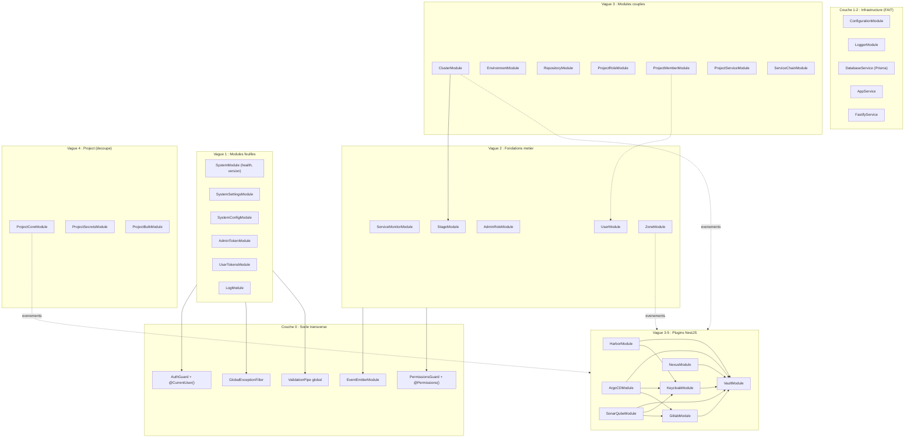

# Cartographie des modules - Modularisation Backend

> Derniere mise a jour : **2026-04-09** (Migration ServiceChain finalisee)

---

## Objectif de ce document

Cartographier l'ensemble des modules de l'application backend actuelle pour :
1. Identifier les dependances entre modules
2. Prioriser l'ordre de modularisation
3. Estimer la charge de chaque module
4. Faciliter la communication sur les zones en modularisation

---

## Decisions structurantes

| Decision | Choix |
|----------|-------|
| Approche migration | Bottom-up (feuilles d'abord, puis remontee vers les modules couples) |
| Contrats API | Decorateurs NestJS natifs + class-validator (abandon de ts-rest) |
| queries-index.ts | Supprime des le depart : chaque module NestJS possede ses propres queries Prisma |
| Systeme d'evenements | `@nestjs/event-emitter` (remplacement progressif de `@cpn-console/hooks`) |
| Plugins | Deviennent des modules NestJS (encapsulation puis reecriture progressive) |
| Module project | Decoupe en 3 sous-modules : ProjectCore, ProjectSecrets, ProjectBulk |
| Equipe dediee | 2 developpeurs en parallele |

---

## Vue synthetique

**75 routes metier** reparties en **18 modules metier** (dont project eclate en 3),
plus **5 couches transverses** et **7 plugins** a encapsuler.

### Legende des statuts

- FAIT : Deja implemente dans `server-nestjs`
- A CREER : N'existe pas encore
- A MIGRER : Existe dans `server`, a migrer vers `server-nestjs`

---

## Architecture lasagnes - Etat des lieux

```
 Couche                          Etat actuel server-nestjs
+--------------------------------------------------------------+
| Couche 6 : Modules metier (controllers, DTOs)                | A MIGRER
+--------------------------------------------------------------+
| Couche 5 : Plugins (modules NestJS injectables)              | A CREER
+--------------------------------------------------------------+
| Couche 4 : Evenements (EventEmitter, remplacement hooks)     | A CREER
+--------------------------------------------------------------+
| Couche 3 : Securite (AuthGuard, PermissionsGuard, Filters)   | PARTIEL
+--------------------------------------------------------------+
| Couche 2 : Core (AppService, FastifyService)                 | FAIT
+--------------------------------------------------------------+
| Couche 1 : Infrastructure (Config, Logger, DB, HTTP)         | FAIT
+--------------------------------------------------------------+
```

Les couches 1 et 2 sont en place. La couche 3 est **partiellement** en place :
l'auth par token (`x-dso-token`) fonctionne via `AdminPermissionGuard` +
`AuthService`. Il reste a implementer l'auth par session Keycloak
(`@CurrentUser()`), le `PermissionsGuard` projet, et le `GlobalExceptionFilter`.
Les couches 4 et 5 restent a creer.

---

## Couche 0 - Socle transverse (S3, priorite absolue)

Ces elements ne sont pas dans la matrice de scoring car ce ne sont pas des
modules metier. Ils conditionnent cependant la migration de **tous** les modules
qui suivent. Les creer en premier permet que chaque migration de module soit un
exercice de "remplissage" des couches superieures, sans reinventer
l'infrastructure a chaque fois.

### 0a. AuthGuard + decorateur @CurrentUser() — PARTIEL

**Sprint** : S3 (Dev A)
**Remplace** : `authUser()` dans `apps/server/src/utils/controller.ts`

**Etat actuel (2026-04-09)** : La partie auth par token est implementee dans
`infrastructure/auth/` :
- ✅ `AuthService` : validation token SHA256, lookup Prisma
  (PersonalAccessToken + AdminToken), verification status/expiration, calcul
  permissions bitwise (y compris roles globaux)
- ✅ `AdminPermissionGuard` : lit `x-dso-token`, verifie permissions via
  `AdminAuthorized` de `@cpn-console/shared`
- ✅ `@RequireAdminPermission()` : decorateur de metadata pour les permissions admin

**Reste a faire** :
- Validation de session Keycloak (`req.session.user`)
- Fallback session → token (actuellement token uniquement)
- Chargement optionnel du projet (par slug, id, environmentId, repositoryId)
- Injection du profil utilisateur dans la request via `@CurrentUser()`
- Types a definir : `UserProfile`, `UserProjectProfile`, `ProjectPermState`

### 0b. GlobalExceptionFilter

**Sprint** : S3 (Dev B)
**Remplace** : Les classes de `apps/server/src/utils/errors.ts`

Mapping des erreurs :

| Classe actuelle (server) | Equivalent NestJS |
|--------------------------|-------------------|
| `BadRequest400` | `BadRequestException` |
| `Unauthorized401` | `UnauthorizedException` |
| `Forbidden403` | `ForbiddenException` |
| `NotFound404` | `NotFoundException` |
| `Unprocessable422` | `UnprocessableEntityException` |
| `Internal500` | `InternalServerErrorException` |

Le filtre global intercepte les `HttpException` NestJS et les formate dans le
schema de reponse attendu par le client (`{ status, body: { message } }`).

### 0c. PermissionsGuard + decorateur @Permissions()

**Sprint** : S3-S4 (Dev A)
**Remplace** : `getProjectPermissions`, `AdminAuthorized`, `ProjectAuthorized` dans `utils/controller.ts`

Fonctionnalites :
- Decorateur `@Permissions(permission)` a poser sur les methodes de controller
- Guard qui verifie les bitmasks de permissions (admin et projet)
- Support des deux niveaux : `AdminRole` (global) et `ProjectRole` (scope projet)

### 0d. ValidationPipe global

**Sprint** : S3 (Dev B)
**Remplace** : La validation Zod des contrats ts-rest

Configuration :
- `class-validator` + `class-transformer` en pipe global
- `whitelist: true` (strip des proprietes non declarees)
- `forbidNonWhitelisted: true` (erreur si proprietes inconnues)
- `transform: true` (transformation automatique des types)

### 0e. EventEmitterModule

**Sprint** : S4-S5 (Dev A)
**Remplace** : `@cpn-console/hooks` (premiere iteration)

Mise en place de `@nestjs/event-emitter` avec :
- Evenements types pour chaque hook actuel (ProjectUpserted, ClusterDeleted, etc.)
- Pattern `@OnEvent('project.upserted')` pour les abonnements
- Pas de steps pre/check/main/post dans cette v1 : orchestration lineaire

Ce module sera utilise par les modules metier des la Vague 2 (quand les modules
avec hooks commencent a etre migres).

---

## Matrice de priorisation

### Criteres de scoring

| Critere | Poids | Description |
|---------|-------|-------------|
| Dependances faibles | 40% | Moins de dependances sortantes = plus facile a extraire (bottom-up) |
| Criticite | 30% | Balance risque/valeur. Un module critique et bien delimite score haut |
| Trafic | 20% | Volume raisonnable pour validation de la migration |
| Difficulte (inversee) | 10% | Complexite technique inversee (facile = score eleve) |

### Formule

```
Score = (Dependances x 0.4) + (Criticite x 0.3) + (Trafic x 0.2) + (Difficulte x 0.1)

Echelle : 1-10 pour chaque critere.
Plus le score est eleve, plus le module est prioritaire.
```

### Resultats ordonnes par score

| Rang | Module | Type | Score | Vague | Sprint | Statut |
|------|--------|------|-------|-------|--------|--------|
| 1 | vault (encapsulation) | Plugin | 8.5 | V3 | S7-S8 | ✅ MIGRE |
| 2 | system (health/version) | Metier | 7.8 | V1 | S3 | ✅ MIGRE |
| 3 | system/settings | Metier | 7.4 | V1 | S3 | ✅ MIGRE |
| 4 | system/config | Metier | 7.4 | V1 | S3-S4 | |
| 5 | keycloak (encapsulation) | Plugin | 7.4 | V3 | S8 | ✅ MIGRE |
| 6 | admin-token | Metier | 7.1 | V1 | S3-S4 | |
| 7 | user/tokens | Metier | 7.1 | V1 | S3-S4 | |
| 8 | gitlab (encapsulation) | Plugin | 6.7 | V4 | S9 | ✅ MIGRE |
| 9 | service-monitor | Metier | 6.6 | V2 | S5 | |
| 10 | user | Metier | 6.6 | V2 | S5 | |
| 11 | stage | Metier | 6.5 | V2 | S5-S6 | |
| 12 | log | Metier | 6.5 | V1 | S4 | |
| 13 | zone | Metier | 6.4 | V2 | S6 | |
| 14 | environment | Metier | 6.3 | V3 | S7 | |
| 15 | admin-role | Metier | 6.1 | V2 | S5 | |
| 16 | project-core | Metier | 5.8 | V4 | S9 | |
| 17 | service-chain | Metier | 5.9 | V3 | S8 | ✅ MIGRE |
| 18 | repository | Metier | 5.8 | V3 | S7-S8 | |
| 19 | cluster | Metier | 5.7 | V3 | S7 | |
| 20 | harbor (encapsulation) | Plugin | 5.6 | V4 | S9-S10 | ✅ MIGRE |
| 21 | project-service | Metier | 5.6 | V3 | S8 | |
| 22 | argocd (encapsulation) | Plugin | 5.3 | V5 | S10-S11 | ✅ MIGRE |
| 23 | project-role | Metier | 5.2 | V3 | S7-S8 | |
| 24 | nexus (encapsulation) | Plugin | 5.1 | V4 | S10 | ✅ MIGRE |
| 25 | project-member | Metier | 4.7 | V3 | S8 | |
| 26 | project-secrets | Metier | 4.6 | V4 | S9 | |
| 27 | project-bulk | Metier | 4.2 | V4 | S9-S10 | |
| 28 | sonarqube (encapsulation) | Plugin | 4.2 | V5 | S11 | |

**Note** : Le score brut ne dicte pas directement l'ordre de migration.
L'ordre reel est contraint par le graphe de dependances (bottom-up), les
pre-requis transverses, et la parallelisation a 2 devs. C'est pourquoi `vault`
(score 8.5) est en Vague 3 et non en Vague 1 : son encapsulation NestJS
necessite l'EventEmitter et un pattern valide sur les modules metier simples.

---

## Vague 1 - Quick wins et validation du pattern (S3-S4)

**Objectif** : Valider le pattern NestJS complet (Controller, Service, Prisma,
AuthGuard, DTOs class-validator, ExceptionFilter). Former l'equipe. Deployer
les premiers modules via Nginx.

**Livrable fin S4** : 13 routes migrees (~17%)

### 1. system (health/version)

| Attribut | Valeur |
|----------|--------|
| **Routes** | 2 |
| **Score** | 7.8 |
| **Sprint** | S3 |
| **Dev** | A |

**Routes** :
- `GET /api/v1/version` - Version de l'application
- `GET /api/v1/healthz` - Health check

**Dependances sortantes** : Aucune (lecture de variable d'env)
**Dependances entrantes** : Aucune

**Points d'attention** :
- Module le plus simple du codebase. Ideal pour valider le pipeline complet :
  creation controller NestJS, deploiement Docker, bascule Nginx
- Pas d'authentification requise sur ces routes

**Estimation** : 0.5 jour

---

### 2. system/settings — ✅ MIGRE (2026-04-28)

| Attribut | Valeur |
|----------|--------|
| **Routes** | 2 |
| **Score** | 7.4 |
| **Sprint** | S3 |
| **Dev** | B |

**Routes** :
- `GET /api/v1/system/settings` - Liste des parametres systeme
- `PUT /api/v1/system/settings` - Mise a jour d'un parametre

**Dependances sortantes** : Aucune (queries propres, Prisma direct)
**Dependances entrantes** : Aucune

**Points d'attention** :
- Premiere occasion de valider le pattern CRUD NestJS avec DTOs
- Auth requise (admin uniquement)

**Estimation** : 1 jour

---

### 3. system/config

| Attribut | Valeur |
|----------|--------|
| **Routes** | 2 |
| **Score** | 7.4 |
| **Sprint** | S3-S4 |
| **Dev** | A |

**Routes** :
- `GET /api/v1/admin/plugins-config` - Configuration des plugins
- `PUT /api/v1/admin/plugins-config` - Mise a jour de la configuration

**Dependances sortantes** : Aucune (queries propres)
**Dependances entrantes** : Aucune

**Points d'attention** :
- Auth admin requise
- Gestion de la configuration JSON des plugins (AdminPlugin en BDD)

**Estimation** : 1 jour

---

### 4. admin-token

| Attribut | Valeur |
|----------|--------|
| **Routes** | 3 |
| **Score** | 7.1 |
| **Sprint** | S3-S4 |
| **Dev** | B |

**Routes** :
- `GET /api/v1/admin/tokens` - Liste des tokens de service admin
- `POST /api/v1/admin/tokens` - Creation d'un token
- `DELETE /api/v1/admin/tokens/:tokenId` - Suppression d'un token

**Dependances sortantes** : Aucune (Prisma direct, pas de queries-index)
**Dependances entrantes** : Aucune

**Points d'attention** :
- Auth admin requise
- Premier module avec CRUD complet et generation de token (hash bcrypt)
- Pas de hook-wrapper utilise

**Estimation** : 1 jour

---

### 5. user/tokens

| Attribut | Valeur |
|----------|--------|
| **Routes** | 3 |
| **Score** | 7.1 |
| **Sprint** | S3-S4 |
| **Dev** | A |

**Routes** :
- `GET /api/v1/users/me/tokens` - Liste des tokens personnels
- `POST /api/v1/users/me/tokens` - Creation d'un token personnel
- `DELETE /api/v1/users/me/tokens/:tokenId` - Suppression d'un token

**Dependances sortantes** : Aucune (Prisma direct)
**Dependances entrantes** : Aucune

**Points d'attention** :
- Auth utilisateur requise (scope personnel : l'utilisateur gere ses propres tokens)
- Similaire a admin-token, bon pour paralleliser
- Hash bcrypt des tokens

**Estimation** : 1 jour

---

### 6. log

| Attribut | Valeur |
|----------|--------|
| **Routes** | 1 |
| **Score** | 6.5 |
| **Sprint** | S4 |
| **Dev** | B |

**Routes** :
- `GET /api/v1/projects/:projectId/logs` - Logs d'audit du projet

**Dependances sortantes** : `queries-index` (lecture seule via `getAllLogs`)
**Dependances entrantes** : Aucune (beaucoup de modules *ecrivent* des logs
via `addLogs`, mais ce module ne fait que *lire*)

**Points d'attention** :
- Premiere rencontre avec queries-index. La strategie est de creer les queries
  Prisma directement dans le module NestJS (pas de barrel partage)
- Auth utilisateur requise, scope projet
- Read-only : pas de hooks

**Estimation** : 0.5 jour

---

## Vague 2 - Fondations metier et premiers hooks (S5-S6)

**Objectif** : Migrer les modules qui sont des dependances pour d'autres.
Introduction de l'EventEmitter dans les modules avec hooks. `stage`, `zone`
et `user` sont des pre-requis pour la Vague 3 (cluster, project-member).

**Livrable fin S6** : 34 routes migrees (~45%)

### 7. service-monitor

| Attribut | Valeur |
|----------|--------|
| **Routes** | 3 |
| **Score** | 6.6 |
| **Sprint** | S5 |
| **Dev** | A |

**Routes** :
- `GET /api/v1/services` - Sante des services (plugins)
- `GET /api/v1/services/all` - Sante complete de tous les services
- `POST /api/v1/services/refresh` - Rafraichissement des statuts

**Dependances sortantes** : `@cpn-console/hooks` (appel direct des moniteurs de plugins)
**Dependances entrantes** : Aucune

**Points d'attention** :
- Premier module utilisant le systeme de hooks (via les moniteurs de plugins)
- Bon premier test de l'EventEmitter : les plugins exposent leur moniteur,
  le service-monitor les interroge
- Pas de queries Prisma (pas d'interaction BDD)

**Estimation** : 1 jour

---

### 8. user

| Attribut | Valeur |
|----------|--------|
| **Routes** | 4 |
| **Score** | 6.6 |
| **Sprint** | S5 |
| **Dev** | B |

**Routes** :
- `GET /api/v1/users` - Recherche d'utilisateurs (matching)
- `POST /api/v1/auth` - Authentification / synchronisation session
- `GET /api/v1/admin/users` - Liste complete des utilisateurs (admin)
- `PATCH /api/v1/admin/users` - Modification utilisateurs (admin)

**Dependances sortantes** : `queries-index` (getMatchingUsers, getUsers), hooks (adminRole.upsert)
**Dependances entrantes** : `project-member` (importe `logViaSession`), `utils/controller.ts` (importe `logViaSession`, `logViaToken`)

**Points d'attention** :
- Module critique : `logViaSession` et `logViaToken` sont consommes par le
  systeme d'auth. Ces fonctions auront ete portees dans l'AuthGuard (Couche 0),
  donc la dependance entrante est deja resolue
- Hooks utilises (adminRole.upsert) : necessite l'EventEmitter
- Pre-requis pour `project-member` (Vague 3)

**Estimation** : 2 jours

---

### 9. admin-role

| Attribut | Valeur |
|----------|--------|
| **Routes** | 5 |
| **Score** | 6.1 |
| **Sprint** | S5 |
| **Dev** | A |

**Routes** :
- `GET /api/v1/admin/roles` - Liste des roles admin
- `POST /api/v1/admin/roles` - Creation d'un role
- `PATCH /api/v1/admin/roles` - Modification des roles
- `GET /api/v1/admin/roles/member-counts` - Comptage des membres par role
- `DELETE /api/v1/admin/roles/:roleId` - Suppression d'un role

**Dependances sortantes** : `queries-index` (getAdminRoleById, listAdminRoles), hooks (adminRole.upsert, adminRole.delete)
**Dependances entrantes** : Aucune

**Points d'attention** :
- Valide le pattern hooks + EventEmitter dans un contexte admin
- Permissions admin (bitmask) : valide le PermissionsGuard
- Queries a internaliser dans le module

**Estimation** : 1.5 jours

---

### 10. stage

| Attribut | Valeur |
|----------|--------|
| **Routes** | 5 |
| **Score** | 6.5 |
| **Sprint** | S5-S6 |
| **Dev** | B |

**Routes** :
- `GET /api/v1/stages` - Liste des stages (dev, staging, prod, etc.)
- `GET /api/v1/stages/:stageId/environments` - Environnements d'un stage
- `POST /api/v1/stages` - Creation d'un stage
- `PUT /api/v1/stages/:stageId` - Modification d'un stage
- `DELETE /api/v1/stages/:stageId` - Suppression d'un stage

**Dependances sortantes** : `queries-index` (nombreuses queries stage + cluster)
**Dependances entrantes** : `cluster/business.ts` (importe directement `linkClusterToStages`)

**Points d'attention** :
- Pre-requis critique pour `cluster` (Vague 3). La fonction `linkClusterToStages`
  exportee par stage est consommee directement par cluster. Dans l'architecture
  NestJS, ce sera un service injectable du StageModule exporte et importe par
  ClusterModule
- Pas de hooks directs
- Beaucoup de queries a internaliser (11 fonctions dans queries-index)

**Estimation** : 2 jours

---

### 11. zone

| Attribut | Valeur |
|----------|--------|
| **Routes** | 4 |
| **Score** | 6.4 |
| **Sprint** | S6 |
| **Dev** | A |

**Routes** :
- `GET /api/v1/zones` - Liste des zones
- `POST /api/v1/zones` - Creation d'une zone
- `PUT /api/v1/zones/:zoneId` - Modification d'une zone
- `DELETE /api/v1/zones/:zoneId` - Suppression d'une zone

**Dependances sortantes** : `queries-index` (addLogs), `./queries` (linkZoneToClusters), hooks (zone.upsert, zone.delete)
**Dependances entrantes** : Aucune directe (mais les hooks zone declenchent des actions dans les plugins keycloak, vault, gitlab)

**Points d'attention** :
- Hooks utilises : zone.upsert et zone.delete declenchent des operations dans
  5 plugins (vault, keycloak, gitlab, argocd). C'est le premier module ou
  l'EventEmitter sera teste en profondeur
- Interaction avec clusters via `linkZoneToClusters`
- Gestion des logs d'audit (addLogs)

**Estimation** : 2 jours

---

## Vague 3 - Modules couples + debut encapsulation plugins (S7-S8)

**Objectif** : Migrer les modules a dependances croisees directes. En parallele,
debut d'encapsulation des plugins feuilles (vault, keycloak) dans des modules
NestJS injectables.

**Livrable fin S8** : 66 routes migrees (~88%) + plugins vault et keycloak encapsules

### 12. cluster

| Attribut | Valeur |
|----------|--------|
| **Routes** | 7 |
| **Score** | 5.7 |
| **Sprint** | S7 |
| **Dev** | A |

**Routes** :
- `GET /api/v1/clusters` - Liste des clusters
- `GET /api/v1/clusters/:clusterId` - Details d'un cluster
- `GET /api/v1/clusters/:clusterId/usage` - Utilisation d'un cluster
- `POST /api/v1/clusters` - Creation d'un cluster
- `GET /api/v1/clusters/:clusterId/environments` - Environnements d'un cluster
- `PUT /api/v1/clusters/:clusterId` - Modification d'un cluster
- `DELETE /api/v1/clusters/:clusterId` - Suppression d'un cluster

**Dependances sortantes** :
- `queries-index` (15+ fonctions : addLogs, createCluster, deleteCluster,
  getClusterById, getClusterByLabel, getClusterDetails, getClusterEnvironments,
  getProjectsByClusterId, linkClusterToProjects, linkZoneToClusters, listClusters,
  listStagesByClusterId, removeClusterFromProject, removeClusterFromStage, updateCluster)
- **`stage/business.ts`** (import direct : `linkClusterToStages`)
- hooks (cluster.upsert, cluster.delete)
- `utils/business.ts` (Result monad)

**Dependances entrantes** : Aucune directe

**Points d'attention** :
- Module le plus complexe en termes de dependances sortantes
- La dependance directe vers `stage/business` sera resolue par un import du
  StageModule dans ClusterModule (stage migre en Vague 2)
- 15+ queries a internaliser dans le module
- Hooks cluster declenchent des operations dans vault et argocd
- Gestion des kubeconfigs (donnees sensibles)

**Estimation** : 3 jours

---

### 13. environment

| Attribut | Valeur |
|----------|--------|
| **Routes** | 4 |
| **Score** | 6.3 |
| **Sprint** | S7 |
| **Dev** | B |

**Routes** :
- `GET /api/v1/projects/:projectId/environments` - Liste des environnements
- `POST /api/v1/projects/:projectId/environments` - Creation d'un environnement
- `PUT /api/v1/environments/:environmentId` - Modification d'un environnement
- `DELETE /api/v1/environments/:environmentId` - Suppression d'un environnement

**Dependances sortantes** : `queries-index` (addLogs, deleteEnvironment, getEnvironmentsByProjectId, initializeEnvironment, updateEnvironment), hooks
**Dependances entrantes** : Aucune directe

**Points d'attention** :
- Utilise le pattern `Result<T>` (monad Success/Failure) de `utils/business.ts`.
  A decider si on conserve ce pattern dans NestJS ou si on passe aux exceptions
- Scope projet : necessite le PermissionsGuard avec `ProjectAuthorized`
- Hooks environnement declenchent des operations dans les plugins

**Estimation** : 2 jours

---

### 14. repository

| Attribut | Valeur |
|----------|--------|
| **Routes** | 5 |
| **Score** | 5.8 |
| **Sprint** | S7-S8 |
| **Dev** | B |

**Routes** :
- `GET /api/v1/projects/:projectId/repositories` - Liste des depots
- `POST /api/v1/projects/:projectId/repositories/sync` - Synchronisation d'un depot
- `POST /api/v1/projects/:projectId/repositories` - Creation d'un depot
- `PUT /api/v1/repositories/:repositoryId` - Modification d'un depot
- `DELETE /api/v1/repositories/:repositoryId` - Suppression d'un depot

**Dependances sortantes** : `queries-index` (addLogs, deleteRepository, getProjectInfosAndRepos, getProjectRepositories, initializeRepository, updateRepository), hooks (project.upsert, misc.syncRepository)
**Dependances entrantes** : Aucune directe

**Points d'attention** :
- Le hook `misc.syncRepository` est specifique a ce module (declenchement de
  pipeline miroir GitLab)
- Scope projet : PermissionsGuard requis
- Gestion des credentials de miroir (donnees sensibles dans Vault)

**Estimation** : 2 jours

---

### 15. project-role

| Attribut | Valeur |
|----------|--------|
| **Routes** | 5 |
| **Score** | 5.2 |
| **Sprint** | S7-S8 |
| **Dev** | A |

**Routes** :
- `GET /api/v1/projects/:projectId/roles` - Liste des roles projet
- `POST /api/v1/projects/:projectId/roles` - Creation d'un role
- `PATCH /api/v1/projects/:projectId/roles` - Modification des roles
- `GET /api/v1/projects/:projectId/roles/member-counts` - Comptage des membres
- `DELETE /api/v1/projects/:projectId/roles/:roleId` - Suppression d'un role

**Dependances sortantes** : `queries-index` (deleteRole, listMembers, listRoles, updateRole), hooks (projectRole.upsert, projectRole.delete)
**Dependances entrantes** : Aucune directe

**Points d'attention** :
- Pattern similaire a admin-role (migre en Vague 2) mais scope projet
- Bitmask de permissions projet
- Hooks projectRole declenchent des operations dans Keycloak

**Estimation** : 1.5 jours

---

### 16. project-member

| Attribut | Valeur |
|----------|--------|
| **Routes** | 4 |
| **Score** | 4.7 |
| **Sprint** | S8 |
| **Dev** | A |

**Routes** :
- `GET /api/v1/projects/:projectId/members` - Liste des membres
- `POST /api/v1/projects/:projectId/members` - Ajout d'un membre
- `PATCH /api/v1/projects/:projectId/members` - Modification des membres
- `DELETE /api/v1/projects/:projectId/members/:memberId` - Retrait d'un membre

**Dependances sortantes** :
- **`user/business.ts`** (import direct : `logViaSession`)
- `queries-index` (addLogs, deleteMember, listMembers, upsertMember)
- hooks (user.retrieveUserByEmail, projectMember.upsert, projectMember.delete)

**Dependances entrantes** : Aucune directe

**Points d'attention** :
- La dependance vers `user/business.ts` (`logViaSession`) aura ete resolue
  par l'AuthGuard (Couche 0). Pas de dependance residuelle vers UserModule
- Hooks projectMember declenchent des operations dans Keycloak
- Recherche d'utilisateur par email via Keycloak (hook user.retrieveUserByEmail)

**Estimation** : 1.5 jours

---

### 17. project-service

| Attribut | Valeur |
|----------|--------|
| **Routes** | 2 |
| **Score** | 5.6 |
| **Sprint** | S8 |
| **Dev** | B |

**Routes** :
- `GET /api/v1/projects/:projectId/services` - Liste des services/plugins du projet
- `PUT /api/v1/projects/:projectId/services` - Mise a jour des services

**Dependances sortantes** : `queries-index` (getAdminPlugin, getProjectInfosByIdOrThrow, getProjectStore, getPublicClusters, saveProjectStore)
**Dependances entrantes** : `utils/hook-wrapper.ts` (importe `ConfigRecords` type et `dbToObj`)

**Points d'attention** :
- Ce module exporte des types et fonctions utilitaires consommes par hook-wrapper.
  Dans l'architecture NestJS, ces types seront definis dans un module partage
  ou dans le ProjectServiceModule exporte
- Gestion de la configuration plugin par projet (JSON store)
- Pas de hooks directs

**Estimation** : 1 jour

---

### 18. service-chain — ✅ MIGRE (2026-04-09)

| Attribut | Valeur |
|----------|--------|
| **Routes** | 5 |
| **Score** | 5.9 |
| **Sprint prevu** | S8 |
| **Migration effective** | 2026-04-09 |
| **Dev** | @stephane.trebel |

**Routes (implementation reelle)** :
- `GET /api/v1/service-chains` - Liste des chaines de service
- `GET /api/v1/service-chains/:id` - Details d'une chaine
- `GET /api/v1/service-chains/:id/flows` - Flux de la chaine
- `POST /api/v1/service-chains/:id/retry` - Relance d'une chaine
- `POST /api/v1/service-chains/validate/:id` - Validation

**Dependances sortantes** : API externe OpenCDS (HTTP via axios)
**Dependances entrantes** : Aucune

**Implementation** :
- Module place dans la catégorie `ThirdPartyModules` (futur module optionnel CPin) comme envisagé
- Auth par token uniquement (`x-dso-token`) via `AdminPermissionGuard`
- Validation UUID sur les parametres d'URL (`ParseUUIDPipe`)
- Validation des reponses OpenCDS via schemas Zod de `@cpn-console/shared`
- Telemetrie via `@StartActiveSpan()` (OpenTelemetry)
- Utilisation d'un service dédié `OpenCdsClientService` afin de gérer les requêtes vers le service OpenCDS externe

**Differences avec le legacy** :
- 403 systematique si permissions insuffisantes (le legacy renvoyait `[]` sur GET /)
- Pas d'auth session Keycloak (token uniquement)
- Validation UUID stricte (400 si format invalide)
- Client OpenCDS dédié dans server-nestjs

**Fichiers** :
- `src/cpin-module/service-chain/service-chain.*.ts`
- `src/cpin-module/service-chain/open-cds-client.*.ts`
- `src/modules/infrastructure/auth/` (AuthModule partage)

---

### Plugin : vault (encapsulation)

| Attribut | Valeur |
|----------|--------|
| **Hooks souscrits** | 7 |
| **Score** | 8.5 |
| **Sprint** | S7-S8 |
| **Dev** | A (en parallele de cluster) |

**Encapsulation** : Wrapper les 3 classes existantes (VaultApi, VaultProjectApi,
VaultZoneApi) dans un `VaultModule` NestJS avec des services `@Injectable()`.
La logique interne reste intacte. Le module expose `VaultService`,
`VaultProjectService`, `VaultZoneService` via DI.

**Dependances sortantes (plugins)** : Aucune (feuille du graphe de plugins)
**Dependances entrantes (plugins)** : gitlab, keycloak, harbor, nexus, sonarqube, argocd (tous)

**Points d'attention** :
- Plugin fondation de toute la chaine. Doit etre encapsule en premier
- Les autres plugins consomment les API classes de vault via le systeme de hooks.
  Dans NestJS, ils importeront VaultModule et injecteront les services
- Configuration par variables d'environnement (a integrer dans ConfigurationService)

**Estimation encapsulation** : 2 jours
**Estimation reecriture complete** : 5 jours (ulterieur)

---

### Plugin : keycloak (encapsulation)

| Attribut | Valeur |
|----------|--------|
| **Hooks souscrits** | 11 (le plus grand nombre) |
| **Score** | 7.4 |
| **Sprint** | S8 |
| **Dev** | B (en parallele de project-member/service-chain) |

**Encapsulation** : Wrapper `KeycloakProjectApi` et les fonctions de `functions.ts`
dans un `KeycloakModule` NestJS.

**Dependances sortantes (plugins)** : vault (runtime via `payload.apis.vault`)
**Dependances entrantes (plugins)** : argocd, harbor, sonarqube

**Points d'attention** :
- 11 hooks souscrits couvrant projets, zones, roles, membres, utilisateurs
- Le plus grand nombre de fonctions exportees (12)
- Utilise `@keycloak/keycloak-admin-client` (dependance externe)
- Necessite vault encapsule avant (depend de VaultModule)

**Estimation encapsulation** : 2 jours
**Estimation reecriture complete** : 5-7 jours (ulterieur)

---

## Vague 4 - Module project (decoupe) + plugins intermediaires (S9-S10)

**Objectif** : Migrer le coeur metier (project) en 3 sous-modules independants.
Encapsuler les plugins intermediaires.

**Livrable fin S10** : 75 routes migrees (100% des routes metier) + plugins
vault, keycloak, gitlab, harbor, nexus encapsules

### 19. project-core

| Attribut | Valeur |
|----------|--------|
| **Routes** | 5 |
| **Score** | 5.8 |
| **Sprint** | S9 |
| **Dev** | A |

**Routes** :
- `GET /api/v1/projects` - Liste des projets
- `GET /api/v1/projects/:projectId` - Details d'un projet
- `POST /api/v1/projects` - Creation d'un projet
- `PUT /api/v1/projects/:projectId` - Modification d'un projet
- `DELETE /api/v1/projects/:projectId` - Archivage d'un projet

**Dependances sortantes** : `queries-index` (addLogs, getProjectOrThrow, getSlugs, initializeProject, listProjects, lockProject, updateProject), hooks (project.upsert, project.delete, projectRole.upsert)
**Dependances entrantes** : Presque tous les modules a scope projet

**Points d'attention** :
- Coeur absolu du systeme. Toute erreur ici impacte tout
- Le CRUD projet declenche des hooks vers TOUS les plugins (upsertProject,
  deleteProject). C'est le plus gros consommateur de l'EventEmitter
- Gestion du statut projet (created/failed/warning/archived) via state machine
- Verrouillage projet (`lockProject`) pendant les operations longues
- La creation declenche : Keycloak (groupes), Vault (KV store), GitLab (groupe +
  repos), Harbor (registre), Nexus (repos), SonarQube (projets), ArgoCD (config)

**Estimation** : 3 jours

---

### 20. project-secrets

| Attribut | Valeur |
|----------|--------|
| **Routes** | 1 |
| **Score** | 4.6 |
| **Sprint** | S9 |
| **Dev** | B |

**Routes** :
- `GET /api/v1/projects/:projectId/secrets` - Secrets du projet

**Dependances sortantes** : hooks (project.getSecrets)
**Dependances entrantes** : Aucune

**Points d'attention** :
- Appelle le hook `getProjectSecrets` qui interroge chaque plugin pour ses
  secrets (Vault, GitLab mirror token, Harbor robot, Nexus credentials, etc.)
- Donnees sensibles : attention au logging et a la serialisation
- Necessite que les plugins soient encapsules pour fonctionner correctement

**Estimation** : 1 jour

---

### 21. project-bulk

| Attribut | Valeur |
|----------|--------|
| **Routes** | 3 |
| **Score** | 4.2 |
| **Sprint** | S9-S10 |
| **Dev** | A |

**Routes** :
- `GET /api/v1/admin/projects/data` - Export bulk des donnees projets
- `POST /api/v1/admin/projects/bulk` - Action bulk sur les projets
- `POST /api/v1/projects/:projectId/replay-hooks` - Rejeu des hooks d'un projet

**Dependances sortantes** : `queries-index` (getAllProjectsDataForExport, deleteAllEnvironmentForProject, deleteAllRepositoryForProject), hooks (project.upsert pour replay)
**Dependances entrantes** : Aucune

**Points d'attention** :
- Routes admin uniquement
- Le bulk action itere sur les projets avec une limite de parallelisme
  (`parallelBulkLimit` dans la config). Attention aux performances
- Le replay-hooks re-execute toute la chaine de hooks pour un projet
- L'export data peut generer de gros payloads

**Estimation** : 2 jours

---

### Plugin : gitlab (encapsulation)

| Attribut | Valeur |
|----------|--------|
| **Hooks souscrits** | 8 |
| **Score** | 6.7 |
| **Sprint** | S9 |
| **Dev** | B |

**Encapsulation** : Wrapper les 3 classes (GitlabApi, GitlabZoneApi,
GitlabProjectApi) dans un `GitlabModule` NestJS.

**Dependances sortantes (plugins)** : vault (VaultProjectApi pour secrets)
**Dependances entrantes (plugins)** : argocd, nexus, sonarqube

**Points d'attention** :
- Plugin le plus complexe (13 fichiers source, classe de 570 lignes)
- Utilise `@gitbeaker/core` et `@gitbeaker/rest` (dependances externes)
- Systeme de "pending commits" (commits bufferises puis envoyes en batch)
- Necessite vault encapsule avant

**Estimation encapsulation** : 2-3 jours
**Estimation reecriture complete** : 7-10 jours (ulterieur)

---

### Plugin : harbor (encapsulation)

| Attribut | Valeur |
|----------|--------|
| **Hooks souscrits** | 3 |
| **Score** | 5.6 |
| **Sprint** | S9-S10 |
| **Dev** | A |

**Encapsulation** : Wrapper dans un `HarborModule` NestJS.

**Dependances sortantes (plugins)** : keycloak (getProjectGroupPath), vault (secrets)
**Dependances entrantes (plugins)** : Aucune

**Points d'attention** :
- API generee (fichier `api/Api.ts`)
- Gestion des quotas (parsing de tailles humaines "100MB", "1.2GB")
- Necessite keycloak et vault encapsules avant

**Estimation encapsulation** : 1.5 jours

---

### Plugin : nexus (encapsulation)

| Attribut | Valeur |
|----------|--------|
| **Hooks souscrits** | 3 |
| **Score** | 5.1 |
| **Sprint** | S10 |
| **Dev** | B |

**Encapsulation** : Wrapper dans un `NexusModule` NestJS.

**Dependances sortantes (plugins)** : vault (secrets)
**Dependances entrantes (plugins)** : Aucune

**Points d'attention** :
- Gestion Maven + NPM (repos group/hosted/snapshot)
- Configuration riche (activation par techno)
- Necessite vault encapsule avant

**Estimation encapsulation** : 1.5 jours

---

## Vague 5 - Plugins terminaux + finalisation (S10-S12)

**Objectif** : Encapsuler les derniers plugins. Demarrer le nettoyage.

**Livrable fin S11** : Tous les plugins encapsules en modules NestJS

### Plugin : argocd (encapsulation)

| Attribut | Valeur |
|----------|--------|
| **Hooks souscrits** | 5 |
| **Score** | 5.3 |
| **Sprint** | S10-S11 |
| **Dev** | A |

**Encapsulation** : Wrapper dans un `ArgoCDModule` NestJS.

**Dependances sortantes (plugins)** : gitlab (GitlabProjectApi), keycloak (KeycloakProjectApi), vault (VaultProjectApi, VaultZoneApi)
**Dependances entrantes (plugins)** : Aucune

**Points d'attention** :
- Le plugin le plus couple (depend de 3 autres plugins)
- Generation YAML complexe (value files pour Helm)
- Necessite gitlab, keycloak et vault encapsules avant
- Dernier plugin avec dependances, donc naturellement parmi les derniers

**Estimation encapsulation** : 2 jours

---

### Plugin : sonarqube (encapsulation)

| Attribut | Valeur |
|----------|--------|
| **Hooks souscrits** | 2 |
| **Score** | 4.2 |
| **Sprint** | S11 |
| **Dev** | B |

**Encapsulation** : Wrapper dans un `SonarQubeModule` NestJS.

**Dependances sortantes (plugins)** : gitlab (GitlabProjectApi pour CI vars), keycloak (getProjectGroupPath), vault (secrets)
**Dependances entrantes (plugins)** : Aucune

**Points d'attention** :
- Depend de 3 autres plugins (comme argocd)
- Interaction avec l'API SonarQube + ecriture de variables CI dans GitLab
- Necessite gitlab, keycloak et vault encapsules avant

**Estimation encapsulation** : 1.5 jours

---

## Vague 6 - Nettoyage (S11-S12)

- Suppression du reverse proxy Nginx (tout pointe vers `server-nestjs`)
- Suppression du code `apps/server`
- Renommage `server-nestjs` en `server`
- Suppression de `@cpn-console/hooks` (remplace par EventEmitter NestJS)
- Suppression de `ts-rest` cote server (remplace par decorateurs NestJS)
- Mise a jour de tous les `docker-compose` et scripts PNPM/Bash
- Reecriture progressive des plugins (au-dela de l'encapsulation) -- planifiee
  dans des iterations futures

---

## Graphe de dependances

### Graphe actuel (genere par Madge)


Commande :

```
npx madge --image dependency-graph.png --extensions js,ts apps/server/src
```

### Graphe cible des modules NestJS



### Dependances directes inter-modules (code actuel)

| Module source | Importe depuis | Fonction | Resolution NestJS |
|---------------|----------------|----------|-------------------|
| cluster | stage/business | `linkClusterToStages` | ClusterModule importe StageModule |
| project-member | user/business | `logViaSession` | Resolu par AuthGuard (Couche 0) |
| utils/controller | user/business | `logViaSession`, `logViaToken` | Resolu par AuthGuard (Couche 0) |
| utils/hook-wrapper | project-service/business | `ConfigRecords`, `dbToObj` | Types partages ou ProjectServiceModule exporte |

### Dependances inter-plugins

```
vault (feuille -- aucune dependance plugin)
  |
  +--- keycloak (vault en runtime)
  |       |
  |       +--- harbor (keycloak + vault)
  |       +--- argocd (gitlab + keycloak + vault)
  |       +--- sonarqube (gitlab + keycloak + vault)
  |
  +--- gitlab (vault)
          |
          +--- nexus (vault, gitlab en devDependency)
          +--- argocd (gitlab + keycloak + vault)
          +--- sonarqube (gitlab + keycloak + vault)
```

---

## Modules transverses

### Middlewares globaux

| Middleware | Statut | Module NestJS |
|-----------|--------|---------------|
| CORS | A configurer | AppService (Fastify) |
| Helmet (securite) | FAIT | AppService |
| Cookie + Session | FAIT | AppService |
| Body parser | FAIT | Fastify (natif) |
| Compression | A evaluer | Fastify compression plugin |
| Logging (requetes) | FAIT | LoggerModule (nestjs-pino) |
| Configuration (.env) | FAIT | ConfigurationModule |
| Validation (DTOs) | A CREER | ValidationPipe global (Couche 0) |

### Services partages

| Service | Statut | Module NestJS |
|---------|--------|---------------|
| PrismaService (DB) | FAIT | DatabaseService |
| LoggerService | FAIT | LoggerModule |
| ConfigService (env) | FAIT | ConfigurationModule |
| HttpClientService | STUB (vide) | A implementer dans InfrastructureModule |
| ServerService (ts-rest) | STUB | A supprimer (abandon ts-rest) |

---

## Checklist de cartographie

### Sprint 1

- [x] Installer outils d'analyse (Madge)
- [x] Generer graphe de dependances automatique
- [x] Lister toutes les routes (75 routes identifiees)
- [x] Identifier les modules metier principaux (16 domaines + 7 plugins)
- [x] Premiere version de cette cartographie

### Sprint 2

- [x] Affiner les dependances inter-modules
- [x] Calculer les scores de priorisation (28 unites scorees)
- [x] Definir l'ordre de modularisation (6 vagues, bottom-up)
- [x] Documenter les points d'attention par module
- [x] Finaliser les estimations de charge
- [x] Completer ce fichier
- [ ] Valider l'ordre de modularisation avec l'equipe

---

## Estimations de charge par vague

| Vague | Sprint | Routes | Modules | Charge estimee (j/p) | Objectif |
|-------|--------|--------|---------|----------------------|----------|
| V0 | S3 | 0 | 5 transverses | 5 j/p | Socle (Guards, Filters, Pipes, EventEmitter) |
| V1 | S3-S4 | 13 | 6 | 5 j/p | Quick wins, validation pattern |
| V2 | S5-S6 | 21 | 5 | 9 j/p | Fondations metier, premiers hooks |
| V3 | S7-S8 | 32 | 7 metier + 2 plugins | 17 j/p | Modules couples, vault + keycloak |
| V4 | S9-S10 | 9 | 3 metier + 3 plugins | 13 j/p | Project decoupe, gitlab + harbor + nexus |
| V5 | S10-S11 | 0 | 2 plugins | 3.5 j/p | argocd + sonarqube |
| V6 | S11-S12 | 0 | 0 | 5 j/p | Nettoyage, suppression server |
| **Total** | **S3-S12** | **75** | **28** | **~57.5 j/p** | |

Avec 2 developpeurs dedies : **~29 jours calendaires** (soit ~6 sprints d'une
semaine), ce qui s'inscrit dans la fenetre S3-S12 (10 sprints disponibles).
La marge de 4 sprints absorbe les imprevisibles, la montee en competence
NestJS, et les eventuelles sessions de pair programming sur les modules
complexes.

---

## Propagation de la modularisation

Mettre a jour dans ce document :
- Le chemin parcouru par un module migre (quel environnement, a quel
  moment/jalon, et avec quel resultat succes/echec)
- Tracer les manques de tests d'integration ou E2E sur un module suivant les
  retours effectues
- Expliciter les regles de suivi dans la metrologie de la migration d'un module
  (avant/apres, payload et requetes concernees, etc.)

---

## Contact

**Responsable cartographie** : @stephane.trebel
**Questions** : #backend-modularisation sur Mattermost

---

**Version** : 2.0
**Derniere mise a jour** : 2026-02-23
**Prochaine revision majeure** : Fin S4 (premier bilan post-Vague 1)
