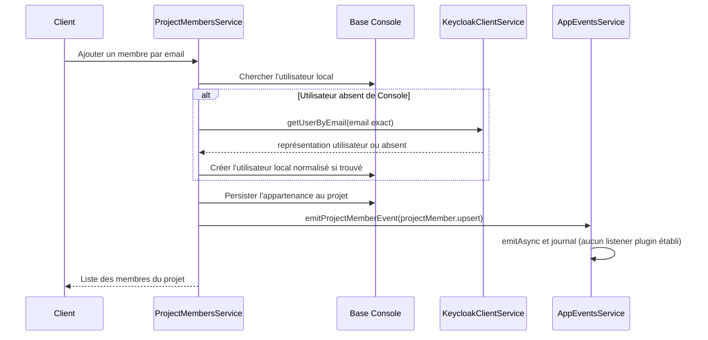
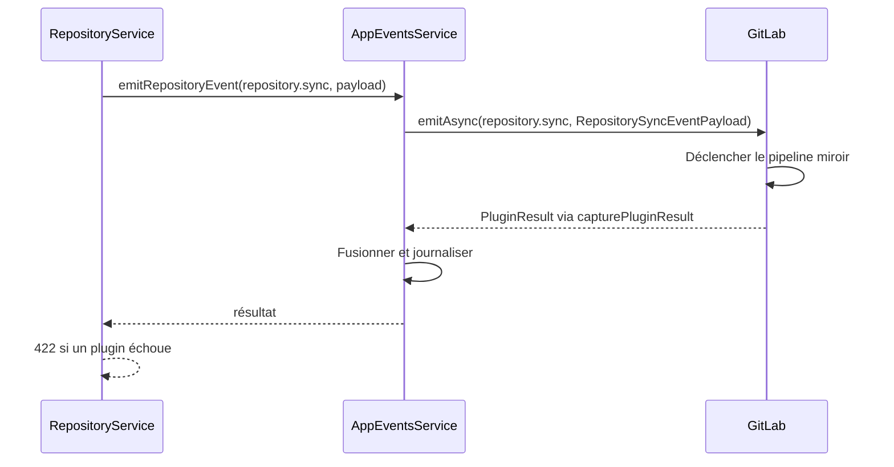

# Cartographie des modules/plugins

Cette cartographie décrit les interactions entre les plugins historiques et leurs modules NestJS de remplacement, distingue l’état observé des contrats cibles recommandés et rend leur delta explicite. Elle couvre les sept modules hérités : ArgoCD, GitLab, Keycloak, Nexus, Vault, Harbor et SonarQube. Le code de Harbor est porté par le module NestJS `registry`.

Les documents de module, colocalisés au code, sont la référence détaillée des coutures. Les dépendances sortantes sont prouvées dans le README du consommateur ; le README du fournisseur en donne une synthèse entrante et renvoie à cette preuve.

## Lire la cartographie

- **Fonctionnelle** : une capacité métier d’un module permet ou complète celle d’un autre.
- **Technique** : la relation est matérialisée par une injection NestJS, un appel de client, un événement, un type, un secret, une persistance ou une API externe.
- Une relation peut être **fonctionnelle et technique**. La nature technique ne remplace pas l’explication de la finalité métier.
- **État observé** : fait étayé par un fichier et un symbole cités. `NestJS direct` désigne un appel inter-module observé ; `événement` désigne un découplage par événement ; `legacy à qualifier` désigne une référence historique dont l’usage runtime n’est pas établi par la seule déclaration.
- **Cible recommandée** : proposition d’architecture, non implémentée. Le **delta** indique ce qu’il faudrait remplacer, ajouter ou qualifier.

## Documents par module

- [ArgoCD](../../apps/server-nestjs/src/modules/argocd/README.md)
- [GitLab](../../apps/server-nestjs/src/modules/gitlab/README.md)
- [Keycloak](../../apps/server-nestjs/src/modules/keycloak/README.md)
- [Nexus](../../apps/server-nestjs/src/modules/nexus/README.md)
- [Vault](../../apps/server-nestjs/src/modules/vault/README.md)
- [Harbor — module `registry`](../../apps/server-nestjs/src/modules/registry/README.md)
- [SonarQube](../../apps/server-nestjs/src/modules/sonarqube/README.md)

## Matrice des coutures observées

| Consommateur                                   | Fournisseur / déclencheur                                          | Finalité                                                                                    | Nature                     | État observé                                                                                 | Détail                                                                |
| ---------------------------------------------- | ------------------------------------------------------------------ | ------------------------------------------------------------------------------------------- | -------------------------- | -------------------------------------------------------------------------------------------- | --------------------------------------------------------------------- |
| ArgoCD                                         | GitLab                                                             | Lire et committer les fichiers de configuration de déploiement par zone.                    | fonctionnelle et technique | NestJS direct (`GitlabClientService`) ; API GitLab de plugin en legacy                       | [ArgoCD](../../apps/server-nestjs/src/modules/argocd/README.md)       |
| ArgoCD                                         | Vault                                                              | Obtenir role-id / secret-id AppRole et configurer l’accès Vault pour le déploiement.        | fonctionnelle et technique | NestJS direct (`VaultClientService`) ; API projet/zone Vault en legacy                       | [ArgoCD](../../apps/server-nestjs/src/modules/argocd/README.md)       |
| GitLab                                         | Vault                                                              | Stocker/lire identifiants de miroirs, tokens et secrets GitLab du plugin.                   | fonctionnelle et technique | NestJS direct (`VaultClientService`) ; API projet Vault en legacy                            | [GitLab](../../apps/server-nestjs/src/modules/gitlab/README.md)       |
| Nexus                                          | Vault                                                              | Persister et retrouver le mot de passe du compte Nexus de projet.                           | fonctionnelle et technique | NestJS direct (`VaultClientService`) ; API injectée Vault en legacy                          | [Nexus](../../apps/server-nestjs/src/modules/nexus/README.md)         |
| Harbor (`registry`)                            | Vault                                                              | Persister et retrouver les secrets de robots du registre.                                   | fonctionnelle et technique | NestJS direct (`VaultClientService`) ; API projet Vault en legacy                            | [Harbor](../../apps/server-nestjs/src/modules/registry/README.md)     |
| SonarQube                                      | GitLab                                                             | Créer le dépôt d’analyse et y gérer ses variables de configuration.                         | fonctionnelle et technique | NestJS direct (`GitlabClientService`) ; API GitLab en legacy                                 | [SonarQube](../../apps/server-nestjs/src/modules/sonarqube/README.md) |
| SonarQube                                      | Vault                                                              | Persister et retrouver le secret de l’utilisateur SonarQube de projet.                      | fonctionnelle et technique | NestJS direct (`VaultClientService`) ; API de projet Vault en legacy                         | [SonarQube](../../apps/server-nestjs/src/modules/sonarqube/README.md) |
| SonarQube (legacy)                             | Keycloak                                                           | Lire le chemin du groupe projet pour configurer les permissions SonarQube.                  | fonctionnelle et technique | Appel historique `KeycloakProjectApi.getProjectGroupPath()` ; absent du module NestJS actuel | [SonarQube](../../apps/server-nestjs/src/modules/sonarqube/README.md) |
| Harbor (legacy)                                | Keycloak                                                           | Ajouter le groupe OIDC projet comme membre du projet Harbor.                                | fonctionnelle et technique | Appel historique `KeycloakProjectApi.getProjectGroupPath()` ; absent de Registry NestJS      | [Harbor](../../apps/server-nestjs/src/modules/registry/README.md)     |
| ArgoCD (legacy)                                | Keycloak                                                           | Obtenir les chemins RO/RW des groupes d’environnement pour le manifest ArgoCD.              | fonctionnelle et technique | Appel historique `KeycloakProjectApi.getEnvGroup()` ; absent du module ArgoCD NestJS         | [ArgoCD](../../apps/server-nestjs/src/modules/argocd/README.md)       |
| Keycloak (legacy)                              | Vault                                                              | Persister le secret du client OIDC créé pour une zone.                                      | fonctionnelle et technique | API Vault de zone `write(..., 'keycloak')` ; absent du module Keycloak NestJS                | [Keycloak](../../apps/server-nestjs/src/modules/keycloak/README.md)   |
| Zone → Keycloak (legacy)                       | Keycloak                                                           | Provisionner/supprimer le client OIDC ArgoCD associé à la zone.                             | fonctionnelle et technique | Hooks `upsertZone`/`deleteZone` legacy ; `zone.*` NestJS n’a pas de consommateur Keycloak    | [Keycloak](../../apps/server-nestjs/src/modules/keycloak/README.md)   |
| Observability (hors périmètre des sept fiches) | GitLab                                                             | Gérer dépôt chart et configuration du projet Observability.                                 | fonctionnelle et technique | NestJS direct (`GitlabClientService`)                                                        | [GitLab](../../apps/server-nestjs/src/modules/gitlab/README.md)       |
| Observability (hors périmètre des sept fiches) | Keycloak                                                           | Gérer groupes et membres RBAC Grafana.                                                      | fonctionnelle et technique | NestJS direct (`KeycloakClientService`)                                                      | [Keycloak](../../apps/server-nestjs/src/modules/keycloak/README.md)   |
| ProjectMembers (module métier)                 | Keycloak                                                           | Résoudre une identité absente de Console par courriel exact lors d’un ajout de membre.      | fonctionnelle et technique | NestJS direct (`getUserByEmail`)                                                             | [Keycloak](../../apps/server-nestjs/src/modules/keycloak/README.md)   |
| Tous les modules consommateurs d’événements    | `AppEventsService`                                                 | Déclencher la réconciliation ou le nettoyage de ressources à partir d’un changement métier. | fonctionnelle et technique | Événements NestJS ; écouteurs indépendants                                                   | [Séquences](#séquences-métier-transverses)                            |
| Modules consommateurs                          | Modules métier (`project`, `repository`, `zone`, `projectMembers`) | Recevoir l’état métier ou de membre concerné.                                               | fonctionnelle et technique | Événements avec charge utile typée                                                           | [Séquences](#séquences-métier-transverses)                            |

La présence d’une dépendance technique dans la matrice ne vaut pas preuve d’un contrat stable. Les imports legacy type-only ou déclaratifs sont qualifiés dans les fiches et ne sont pas assimilés à des appels NestJS.

## Séquences métier transverses

Les événements `project.*` sont émis après la transaction métier. `AppEventsService` attend `EventEmitter2.emitAsync`, fusionne les résultats renvoyés par les écouteurs et écrit un journal. Les écouteurs sont exécutés en parallèle ; chaque `capturePluginResult` transforme l’issue du plugin en résultat `OK` ou `KO` au lieu de laisser son exception court-circuiter l’agrégation.

### Réconcilier un projet

Les émetteurs observés incluent création/mise à jour projet, changements de dépôts, rôles, environnements et déploiements, ainsi que le rejeu des hooks projet. Les écouteurs `project.upsert` actuellement présents sont ArgoCD, GitLab, Keycloak, Nexus, Vault, Harbor/Registry, SonarQube et Observability.

```mermaid
sequenceDiagram
  participant M as Project / Repository
  participant E as AppEventsService
  participant A as Plugins NestJS
  M->>E: emitProjectEvent(project.upsert, project id)
  E->>E: Charger ProjectWithDetails après commit
  E->>A: emitAsync(project.upsert, ProjectWithDetails)
  Note over E,A: Écouteurs ArgoCD, GitLab, Keycloak, Nexus, Vault, Harbor, SonarQube et Observability en parallèle
  A->>A: Chaque écouteur synchronise ses ressources externes
  A-->>E: PluginResults via capturePluginResult
  E->>E: Fusionner résultats et écrire le journal
  E->>E: failed si un plugin est KO ; sinon created pour upsert
  E-->>M: Fin de l’agrégation (appelant poursuit son cas d’usage)
```

Les modifications dépôt modifient d’abord les données et peuvent aussi appliquer l’intention de credentials dans Vault, puis réconcilient le projet. Selon l’opération, le demandeur reçoit une erreur 422 si un plugin est KO ; voir la séquence dépôt ci-dessous.

### Déprovisionner un projet

L’archivage conserve un instantané portant l’ancien slug, modifie le projet en base, puis émet `project.delete`. Les écouteurs suppriment les ressources externes. La suppression ordinaire est à documenter seulement si un émetteur distinct est observé ; ne pas l’inférer de l’événement.

```mermaid
sequenceDiagram
  participant P as ProjectService
  participant E as AppEventsService
  participant A as Plugins NestJS
  P->>P: Archiver en transaction
  P->>E: emitProjectEvent(project.delete, snapshot pré-archivage)
  E->>A: emitAsync(project.delete, ProjectWithDetails)
  Note over E,A: Écouteurs de nettoyage exécutés en parallèle
  A->>A: Supprimer les ressources propres au module
  A-->>E: résultats OK / KO
  E->>E: Journaliser ; marquer failed en cas de KO
  E-->>P: résultats agrégés
```

### Ajouter un membre par courriel absent de Console

`ProjectMembersService` cherche l’utilisateur en base ; si l’entrée par courriel ne donne aucun utilisateur local, appelle `KeycloakClientService.getUserByEmail()` et peut créer l’utilisateur Console à partir du résultat. Il écrit ensuite le lien de membre et émet `projectMember.upsert`. Cet événement est journalisé par `AppEventsService`, mais aucun listener plugin `projectMember.upsert` ou `projectMember.delete` n’a été établi dans les modules étudiés ; la recherche d’identité directe n’équivaut donc pas à une synchronisation Keycloak du membre.



Cette couture peut justifier un port d’identité ciblé côté Keycloak ; un effet externe lors de `projectMember.upsert` reste à établir, pas à présumer.

### Synchroniser un dépôt miroir

Les créations, mises à jour et suppressions de dépôt réconcilient `project.upsert`. Une synchronisation explicite ou la synchronisation initiale d’une source externe émet ensuite `repository.sync` ; seul GitLab porte actuellement un écouteur pour cet événement.



La charge comprend `projectId`, `projectSlug`, `internalRepoName` et soit `syncAllBranches: true`, soit `syncAllBranches: false` et `branchName`.

### Gérer une zone

La création et la mise à jour émettent `zone.upsert`. La suppression vérifie d’abord qu’aucun cluster n’est associé, émet `zone.delete`, puis supprime l’enregistrement. Vault est le seul consommateur actuel de ces deux événements. En legacy, Keycloak créait/supprimait aussi un client OIDC de zone via les hooks `upsertZone`/`deleteZone` et stockait son secret dans Vault ; cette séquence n’est pas reprise par un écouteur Keycloak NestJS.

```mermaid
sequenceDiagram
  participant Z as ZoneService
  participant E as AppEventsService
  participant V as Vault
  participant K as Keycloak (legacy, non migré)
  Z->>E: emitZoneEvent(zone.upsert ou zone.delete, id + slug)
  E->>V: emitAsync(zone.*, ZoneEventPayload)
  V->>V: Synchroniser ou nettoyer les ressources de zone
  V-->>E: PluginResult via capturePluginResult
  Note over E,K: Aucun écouteur Keycloak NestJS ; le hook zone legacy n'est pas appelé par cet événement
  E->>E: Journaliser et agréger
  E-->>Z: résultats
  Z-->>Z: 422 si Vault échoue
```

## Lire les deltas

Chaque README distingue la couture observée de la cible recommandée, nomme le propriétaire du contrat, décrit sa forme métier et ses garanties, puis liste le delta. Les propositions restent des recommandations : les noms de contrats ne sont pas des API adoptées. Les priorités ne sont données que lorsqu’une source les établit ; sinon l’arbitrage est explicitement indiqué.
