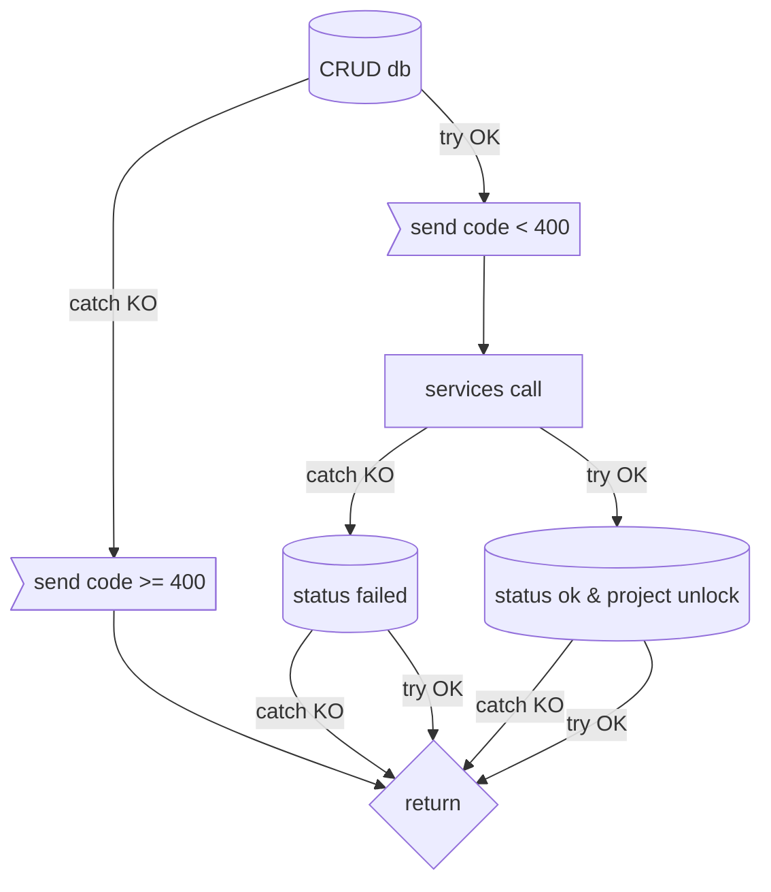

# Logique controllers

```mermaid
flowchart TD
    A[(CRUD db)]
    A -->|catch KO| B>send code >= 400]
    B --> G{return}
    A -->|try OK| C>send code < 400]
    C --> D[services call]
    D -->|catch KO| E[(status failed)]
    E -->|catch KO| G
    E -->|try OK| G
    D -->|try OK| F[(status ok & project unlock)]
    F -->|catch KO| G
    F -->|try OK| G
```
