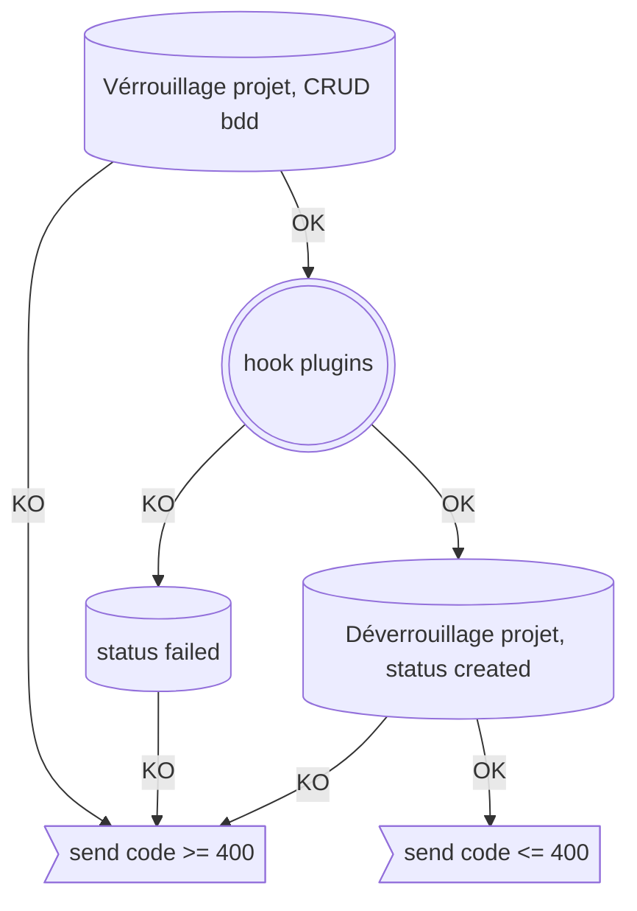

# Logique controllers

```mermaid
flowchart TD
    A[(Vérrouillage projet, CRUD bdd)]
    A -->|KO| B>send code >= 400]
    A -->|OK| D(((hook plugins)))
    D -->|KO| E[(status failed)]
    E -->|KO| B
    D -->|OK| F[(Déverrouillage projet, status created)]
    F -->|OK| G>send code <= 400]
    F -->|KO| B
```
