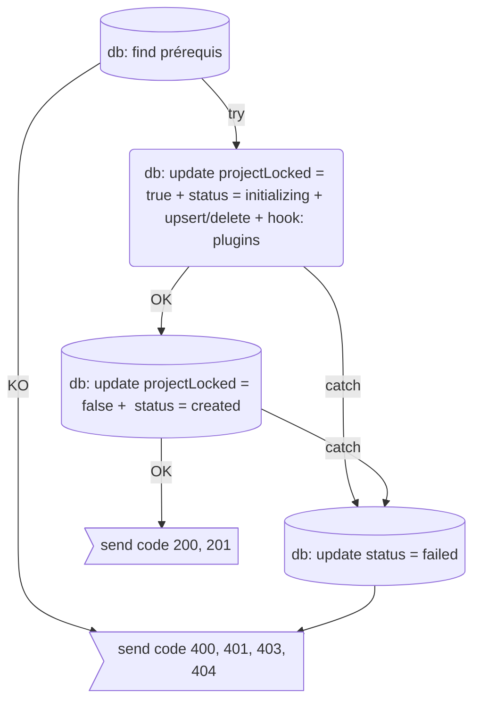

# Logique controllers

```mermaid
flowchart TD
    A[(db: find prérequis)]
    A -->|KO| B>send code 400, 401, 403, 404]
    A -->|try| D(db: update projectLocked = true + status = initializing + upsert/delete + hook: plugins)
    D -->|catch| E[(db: update status = failed)]
    E --> B
    D -->|OK| G[(db: update projectLocked = false +  status = created)]
    G -->|OK| H>send code 200, 201]
    G -->|catch| E
```
