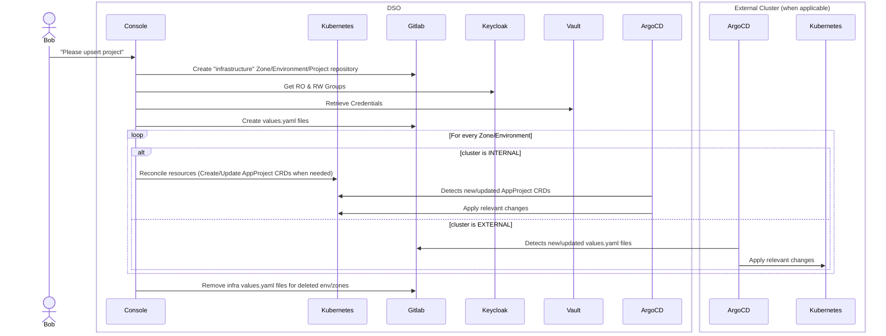
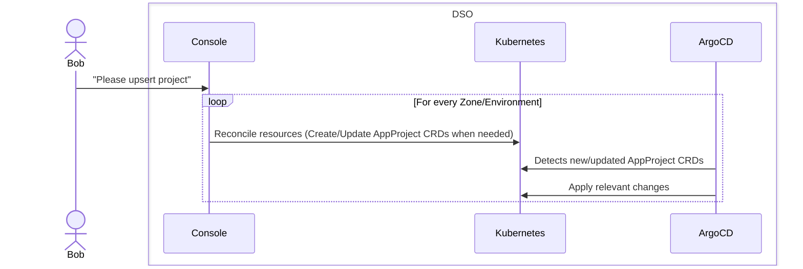
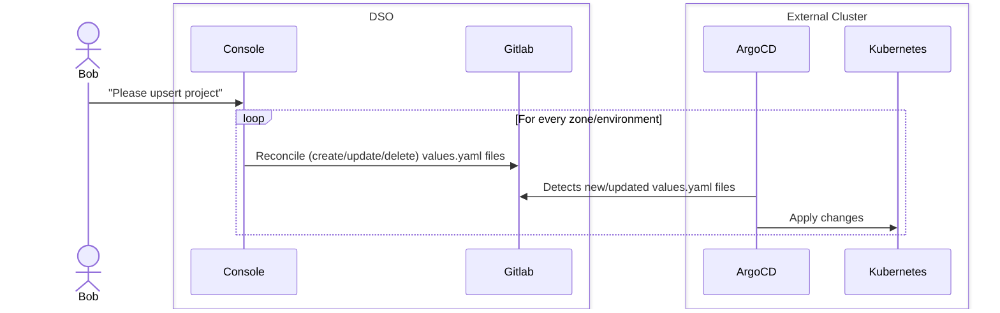
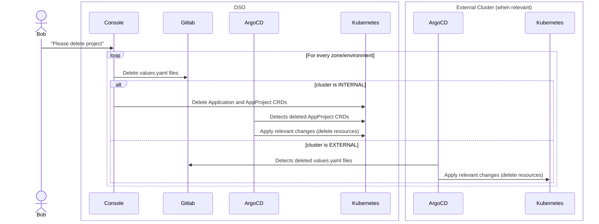
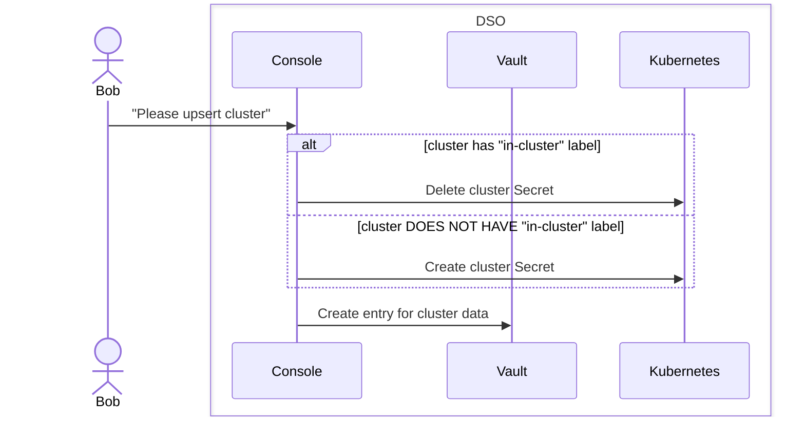
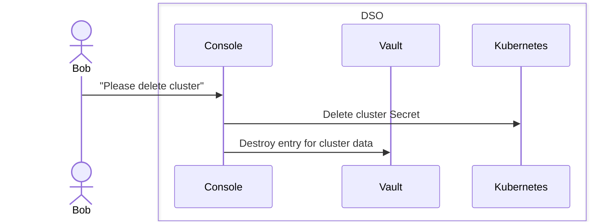
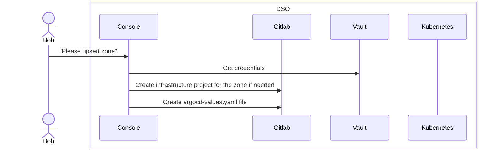
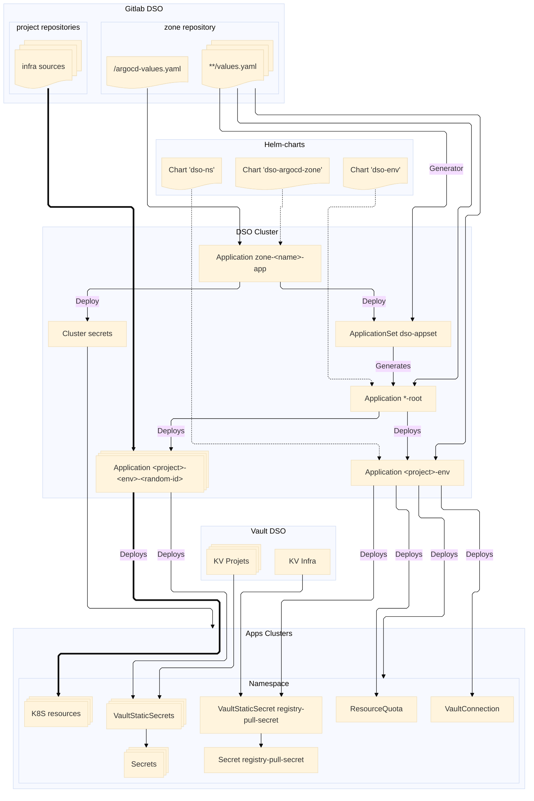

# Plugin ArgoCD

Ce document décrit le fonctionnement du plugin ArgoCD.

# Hooks et Steps supportés

Le seul step supporté est pour l'instant le step `main`. Ceci est applicable à tous les hooks de ce plugin.

## upsertProject hook

Voici le diagramme de séquence du hook le plus important du plugin (`upsert`) :

Il est à noter que ce diagramme décrit deux possibilités différentes qui se basent sur la propriété `cluster.external`.

Cette propriété va un peu plus loin que son nom l'indique a priori : il s'agit véritablement d'un mode de fonctionnement alternatif qui va être progressivement déployé sur les différents projets.

En effet, à l'origine, la console avait à sa charge l'intégralité de la création des ressources, dans un mode de fonctionnement qui est très proche de ce que fait ArgoCD en interne :

Mais, avec l'arrivée de clusters dit "externes" (c'est-à-dire qu'ils sont hors du périmètre de DSO, et gérés de manière autonome par les projets clients), est arrivée une contrainte : On ne peut plus interagir avec l'API Kubernetes (le cluster est "air gapped", soit injoignable de l'extérieur, *a fortiori* depuis la Console).

Il a donc fallu un nouveau paradigme, dans lequel c'est le cluster externe qui **vient récupérer les informations pour se mettre à jour**. Et la manière la plus efficace de faire ça, c'est de basculer en mode "GitOps", un mode dans lequel la Console créerait un fichier de configuration (typiquement un `values.yaml`) qui serait "tiré" par le cluster externe afin d'être traité par l'ArgoCD qui lui est rattaché.

Le flux devient donc le suivant :

Cette migration de l'ancien mode de fonctionnement (En mode "Impératif" d'administration du cluster Kubernetes) au nouveau mode ("GitOps", ou "Déclaratif" pour le cluster externe) va se faire progressivement, mais en attendant les deux flux doivent être maintenus. Toute la branche de code concernant des clusters "internes" finira par disparaître.

## deleteProject hook

## upsertCluster hook

Ce hook sert à la création/modification d'un cluster Kubernetes.
Il est à noter la distinction des clusters étiquetés `in-cluster` pour lesquels la gestion des secrets est différente (c'est une exception à la règle).

## deleteCluster hook

Ce hook sert à la "suppression" d'un cluster Kubernetes.
Il est à noter que le cluster n'est pas vraiment supprimé, mais "oublié" par la Console, qui n'en garde plus trace.

## upsertZone hook

Ce hook sert à la création/modification d'une Zone (qui contiendra donc un ou plusieurs clusters Kubernetes)

# Deployment as-code (declarative mode)

