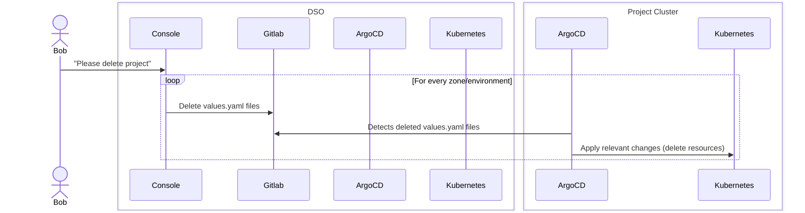
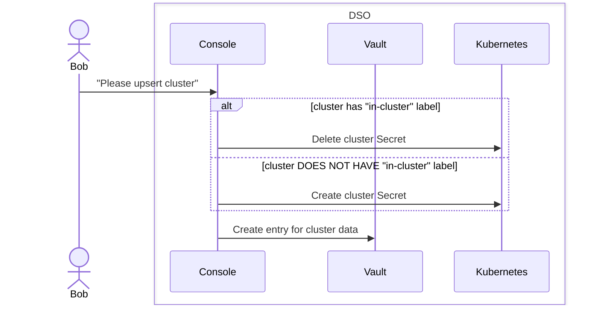
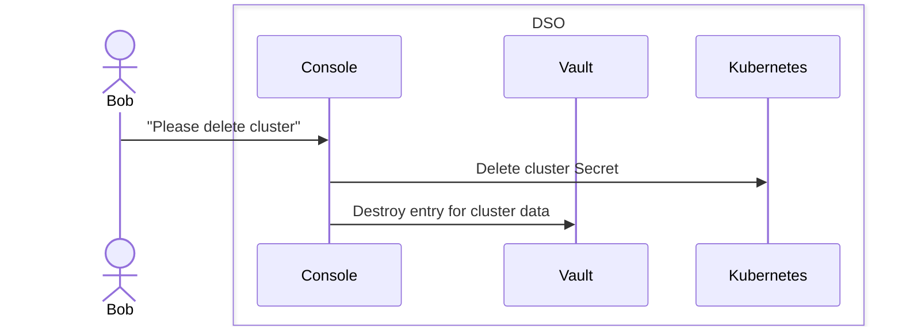
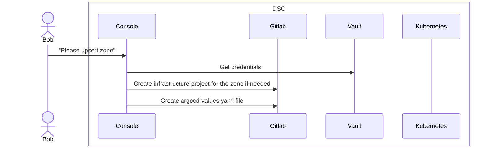

# Plugin ArgoCD

Ce document décrit le fonctionnement du plugin ArgoCD.

# Hooks et Steps supportés

Le seul step supporté est pour l'instant le step `main`. Ceci est applicable à tous les hooks de ce plugin.

## upsertProject hook

Voici le diagramme de séquence du hook le plus important du plugin (`upsert`) :

Les clusters sont dits "externes" car ils sont hors du périmètre de DSO, et gérés de manière autonome par les projets clients, ce qui est une contrainte majeur : on ne peut pas interagir avec l'API Kubernetes (le cluster est considéré comme "air gapped", c'est-à-dire injoignable de l'extérieur, *a fortiori* depuis la Console). C'est en particulier le cas pour les clusters qui se trouvent dans une Zone DR ("Diffusion Restreinte").

C'est pourquoi la Console fonctionne avec son paradigme dans lequel c'est le cluster externe qui **vient récupérer les informations pour se mettre à jour**. Et la manière la plus efficace de faire ça, c'est de fonctionner en mode "GitOps", un mode dans lequel la Console crée un fichier de configuration (typiquement un `values.yaml`) qui serait récupéré (d'où le nom de "pull", en opposition au "push" traditionnel dans lequel on va utiliser les API Kubernetes) par le cluster externe afin d'être traité par l'ArgoCD qui lui est rattaché.

## deleteProject hook

## upsertCluster hook

Ce hook sert à la création/modification d'un cluster Kubernetes.
Il est à noter la distinction des clusters étiquetés `in-cluster` pour lesquels la gestion des secrets est différente (c'est une exception à la règle).

## deleteCluster hook

Ce hook sert à la "suppression" d'un cluster Kubernetes.
Il est à noter que le cluster n'est pas vraiment supprimé, mais "oublié" par la Console, qui n'en garde plus trace.

## upsertZone hook

Ce hook sert à la création/modification d'une Zone (qui contiendra donc un ou plusieurs clusters Kubernetes)

# Deployment as-code (declarative mode)

